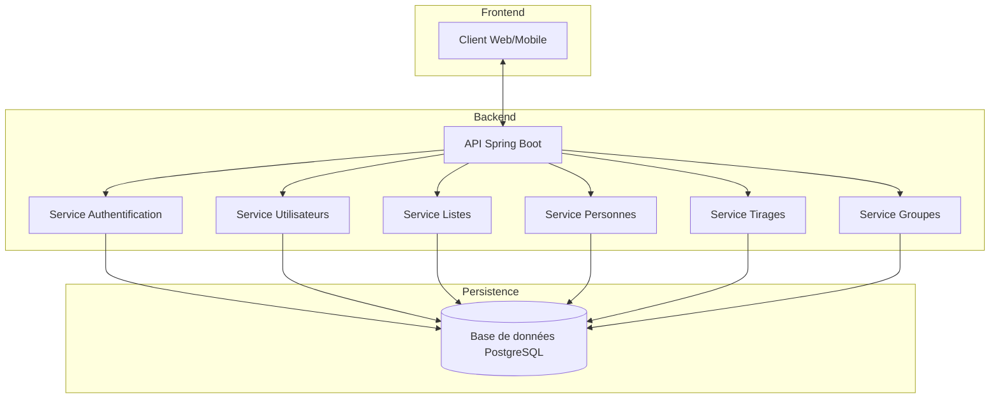
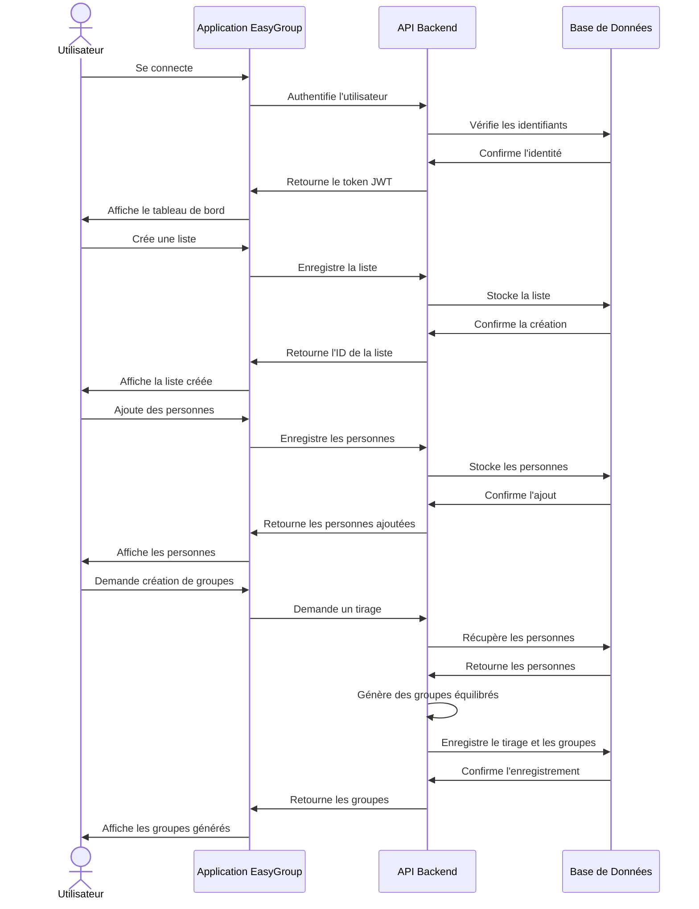

# Documentation EasyGroup

Bienvenue dans la documentation du projet EasyGroup, une application pour la création intelligente de groupes d'apprenants à partir de listes partagées, en tenant compte de divers critères (âge, expérience, profils, etc.).

## Table des Matières

### Guides Utilisateurs et Fonctionnels

- [User Stories](./user-stories.md) - Récits utilisateurs décrivant les fonctionnalités du point de vue des utilisateurs
- [Flux Métiers](./business-flows.md) - Diagrammes des principaux flux métiers de l'application

### Documentation Technique

- [Guide de Démarrage](./getting-started.md) - Instructions pour démarrer avec l'application
- [Documentation API](./api-documentation.md) - Description détaillée des endpoints API disponibles
- [Modèles de Données](./database-models.md) - Description des modèles de données (MCD, MLD, MPD)
- [Guide pour les Développeurs Frontend](./frontend-developer-guide.md) - Guide pour l'intégration frontend avec l'API
- [Guide de Déploiement Docker](./docker-deployment.md) - Instructions pour le déploiement avec Docker
- [Configuration CI/CD](./ci-cd-setup.md) - Informations sur le pipeline CI/CD

## Architecture Globale

L'application EasyGroup est construite selon une architecture moderne et modulaire :

## Fonctionnalités Principales

1. **Gestion des Utilisateurs** - Inscription, connexion, gestion des profils
2. **Gestion des Listes** - Création, modification, suppression et partage de listes de personnes
3. **Gestion des Personnes** - Ajout, modification et suppression de personnes avec leurs caractéristiques
4. **Création de Groupes** - Génération automatique de groupes équilibrés selon divers critères
5. **Historique des Tirages** - Conservation de l'historique des tirages et des groupes créés

## Exemple de Flux Utilisateur

Le diagramme ci-dessous illustre le flux typique d'un utilisateur créant des groupes équilibrés :

## Stack Technique

- **Backend** : Spring Boot 3.2.0, Java 17
- **Base de données** : PostgreSQL 14
- **Sécurité** : Spring Security avec Argon2id pour le hachage des mots de passe
- **Conteneurisation** : Docker et Docker Compose
- **CI/CD** : GitHub Actions

## Contribution

Pour contribuer au projet, veuillez contacter l'équipe de développement.

## Licence

Ce projet est sous licence MIT - voir le fichier [LICENSE](../LICENSE) pour plus de détails.
