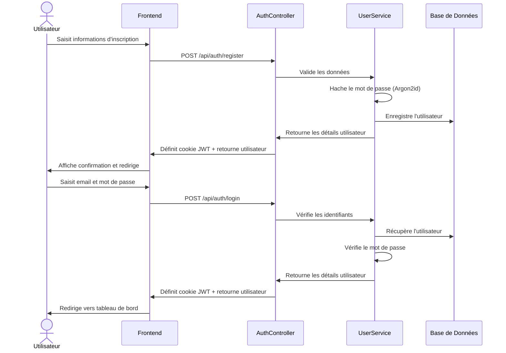
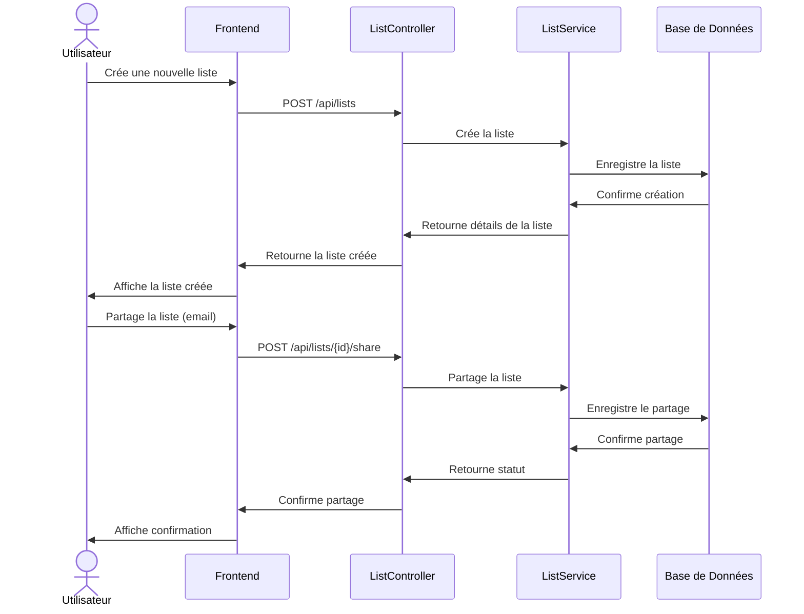
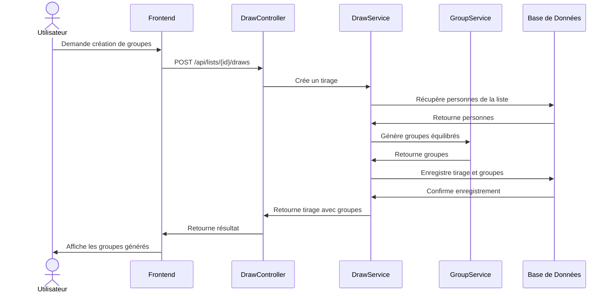
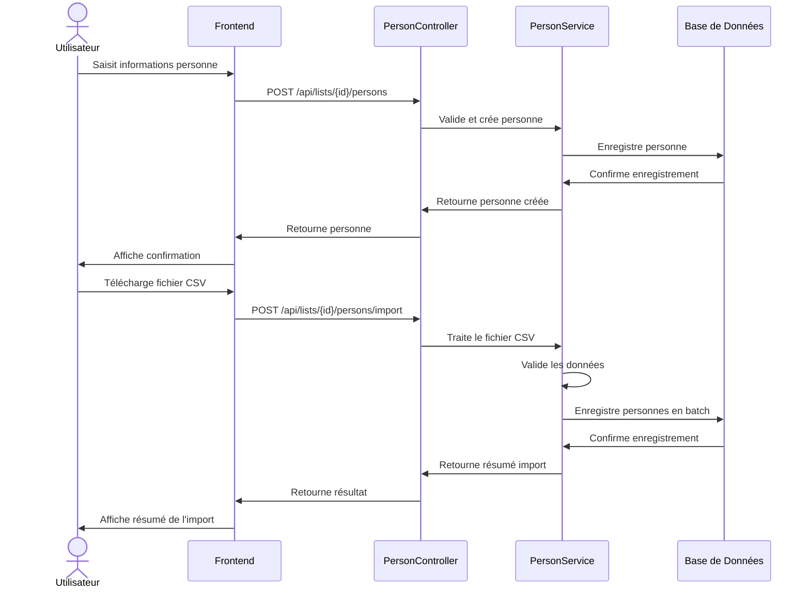
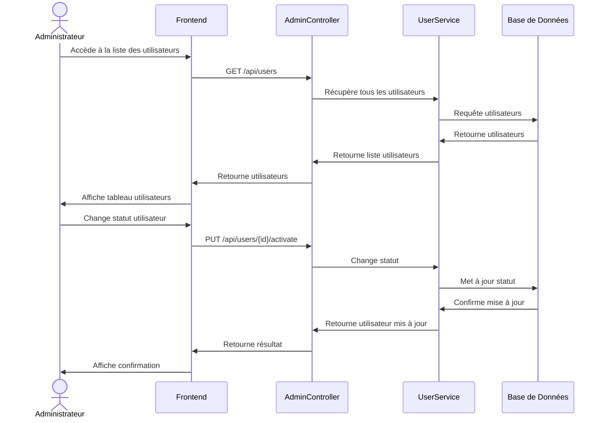
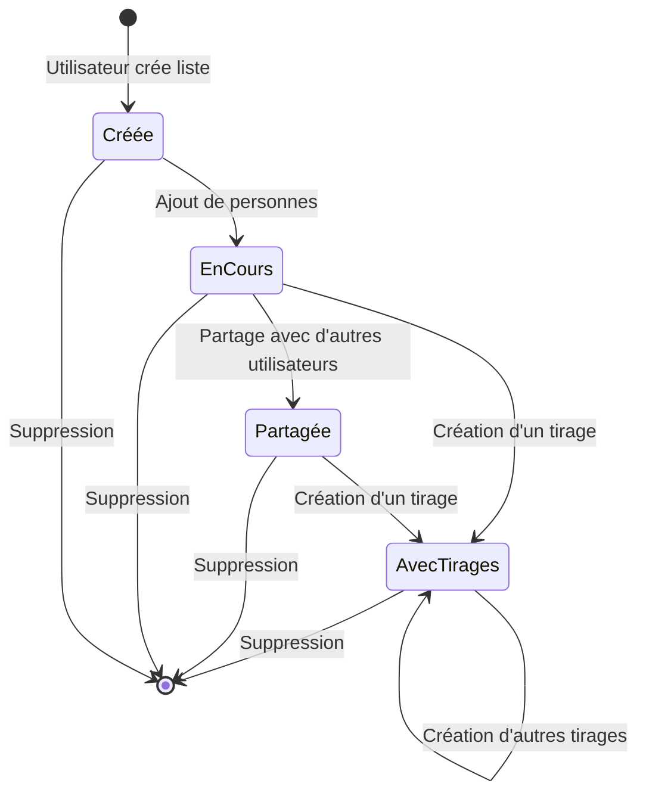
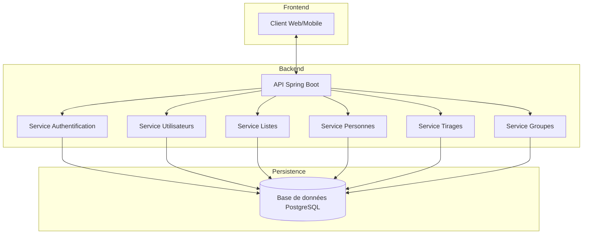

# Flux Métiers - EasyGroup

Ce document présente les principaux flux métiers de l'application EasyGroup à l'aide de diagrammes Mermaid.

## Flux d'Authentification

Le diagramme ci-dessous illustre le processus d'authentification des utilisateurs.

## Flux de Gestion des Listes

Le diagramme ci-dessous illustre le processus de création et de partage d'une liste.

## Flux de Création de Groupes

Le diagramme ci-dessous illustre le processus de création de groupes équilibrés.

## Flux d'Ajout de Personnes

Le diagramme ci-dessous illustre le processus d'ajout de personnes à une liste.

## Flux d'Administration

Le diagramme ci-dessous illustre les processus d'administration.

## Diagramme d'États d'une Liste

Le diagramme ci-dessous illustre les différents états possibles d'une liste.

## Diagramme d'Architecture Globale

Le diagramme ci-dessous illustre l'architecture globale de l'application.

