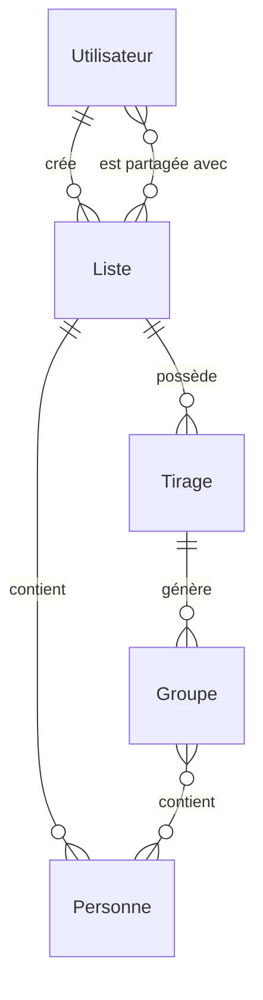
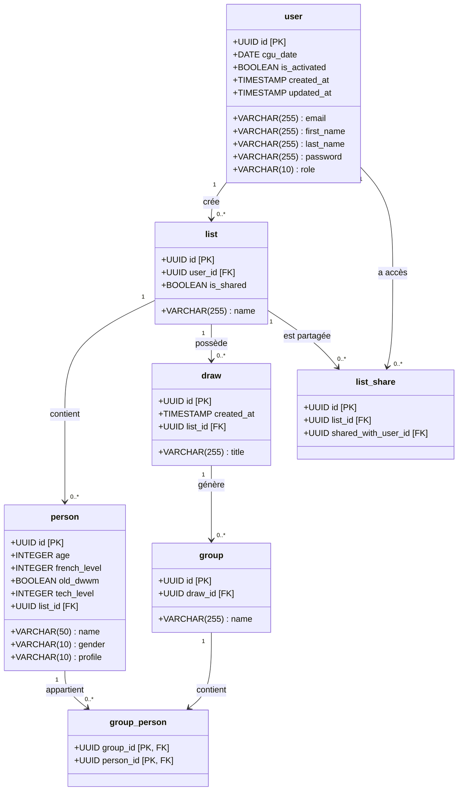
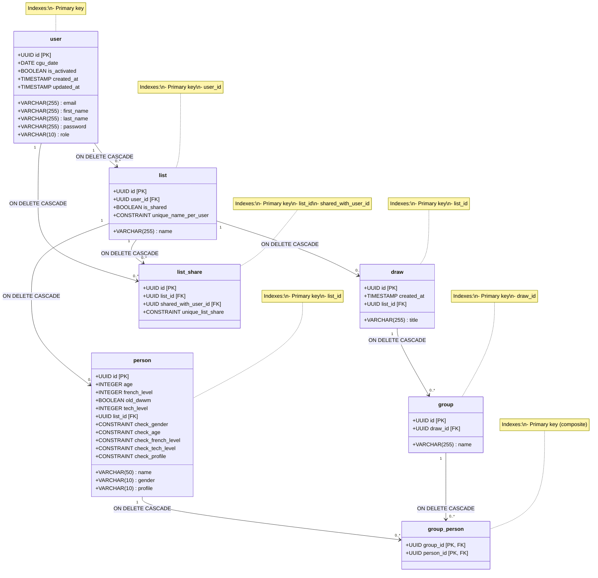

# Modèles de Données EasyGroup

Ce document présente les différents modèles de données utilisés dans l'application EasyGroup.

## Modèle Conceptuel de Données (MCD)

Le Modèle Conceptuel de Données représente les entités et leurs relations à un niveau conceptuel, sans considérations techniques.

### Entités et Attributs

#### Utilisateur
- **id** : Identifiant unique
- **email** : Adresse email (unique)
- **firstName** : Prénom
- **lastName** : Nom
- **password** : Mot de passe
- **cguDate** : Date d'acceptation des CGU
- **isActivated** : Compte activé ou non
- **createdAt** : Date de création
- **updatedAt** : Date de mise à jour
- **role** : Rôle (USER, ADMIN)

#### Liste
- **id** : Identifiant unique
- **name** : Nom de la liste
- **isShared** : Indique si la liste est partagée

#### Personne
- **id** : Identifiant unique
- **name** : Nom de la personne
- **gender** : Genre (FEMALE, MALE, OTHER)
- **age** : Âge
- **frenchLevel** : Niveau de français
- **oldDwwm** : Ancien DWWM ou non
- **techLevel** : Niveau technique
- **profile** : Profil (A_LAISE, RESERVE, TIMIDE)

#### Tirage
- **id** : Identifiant unique
- **createdAt** : Date de création
- **title** : Titre du tirage

#### Groupe
- **id** : Identifiant unique
- **name** : Nom du groupe

#### PartageList
- **id** : Identifiant unique

### Relations

- Un **Utilisateur** peut créer plusieurs **Listes** (relation 1-N)
- Une **Liste** appartient à un seul **Utilisateur** (relation N-1)
- Une **Liste** peut contenir plusieurs **Personnes** (relation 1-N)
- Une **Personne** appartient à une seule **Liste** (relation N-1)
- Une **Liste** peut avoir plusieurs **Tirages** (relation 1-N)
- Un **Tirage** appartient à une seule **Liste** (relation N-1)
- Un **Tirage** peut générer plusieurs **Groupes** (relation 1-N)
- Un **Groupe** appartient à un seul **Tirage** (relation N-1)
- Un **Groupe** peut contenir plusieurs **Personnes** et une **Personne** peut appartenir à plusieurs **Groupes** (relation N-M)
- Une **Liste** peut être partagée avec plusieurs **Utilisateurs** via **PartageList** (relation N-M)

### Diagramme MCD



## Modèle Logique de Données (MLD)

Le Modèle Logique de Données transforme le MCD en tables relationnelles avec des clés primaires et étrangères.

### Tables

#### user
- **id** (PK) : UUID
- **email** : VARCHAR(255) NOT NULL UNIQUE
- **first_name** : VARCHAR(255)
- **last_name** : VARCHAR(255)
- **password** : VARCHAR(255) NOT NULL
- **cgu_date** : DATE
- **is_activated** : BOOLEAN NOT NULL DEFAULT TRUE
- **created_at** : TIMESTAMP NOT NULL
- **updated_at** : TIMESTAMP NOT NULL
- **role** : VARCHAR(10) NOT NULL

#### list
- **id** (PK) : UUID
- **name** : VARCHAR(255) NOT NULL
- **user_id** (FK) : UUID NOT NULL
- **is_shared** : BOOLEAN NOT NULL DEFAULT FALSE
- CONSTRAINT unique_name_per_user UNIQUE (name, user_id)

#### person
- **id** (PK) : UUID
- **name** : VARCHAR(50) NOT NULL
- **gender** : VARCHAR(10) NOT NULL
- **age** : INTEGER NOT NULL
- **french_level** : INTEGER NOT NULL
- **old_dwwm** : BOOLEAN NOT NULL
- **tech_level** : INTEGER NOT NULL
- **profile** : VARCHAR(10) NOT NULL
- **list_id** (FK) : UUID NOT NULL

#### draw
- **id** (PK) : UUID
- **created_at** : TIMESTAMP
- **list_id** (FK) : UUID NOT NULL
- **title** : VARCHAR(255)

#### group
- **id** (PK) : UUID
- **name** : VARCHAR(255)
- **draw_id** (FK) : UUID NOT NULL

#### group_person
- **group_id** (PK, FK) : UUID NOT NULL
- **person_id** (PK, FK) : UUID NOT NULL

#### list_share
- **id** (PK) : UUID
- **list_id** (FK) : UUID NOT NULL
- **shared_with_user_id** (FK) : UUID NOT NULL
- CONSTRAINT unique_list_share UNIQUE (list_id, shared_with_user_id)

### Diagramme MLD



## Modèle Physique de Données (MPD)

Le Modèle Physique de Données ajoute des détails techniques spécifiques à la base de données PostgreSQL.

### Diagramme MPD



### Définition des Tables SQL

```sql
CREATE TABLE "user" (
    id UUID PRIMARY KEY DEFAULT gen_random_uuid(),
    email VARCHAR(255) NOT NULL UNIQUE,
    first_name VARCHAR(255),
    last_name VARCHAR(255),
    password VARCHAR(255) NOT NULL,
    cgu_date DATE,
    is_activated BOOLEAN NOT NULL DEFAULT TRUE,
    created_at TIMESTAMP NOT NULL,
    updated_at TIMESTAMP NOT NULL,
    role VARCHAR(10) NOT NULL CHECK (role IN ('USER', 'ADMIN'))
);

CREATE TABLE list (
    id UUID PRIMARY KEY DEFAULT gen_random_uuid(),
    name VARCHAR(255) NOT NULL,
    user_id UUID NOT NULL,
    is_shared BOOLEAN NOT NULL DEFAULT FALSE,
    CONSTRAINT fk_list_user FOREIGN KEY (user_id) REFERENCES "user" (id) ON DELETE CASCADE,
    CONSTRAINT unique_name_per_user UNIQUE (name, user_id)
);

CREATE TABLE person (
    id UUID PRIMARY KEY DEFAULT gen_random_uuid(),
    name VARCHAR(50) NOT NULL,
    gender VARCHAR(10) NOT NULL CHECK (gender IN ('FEMALE', 'MALE', 'OTHER')),
    age INTEGER NOT NULL CHECK (age > 0),
    french_level INTEGER NOT NULL CHECK (french_level BETWEEN 1 AND 5),
    old_dwwm BOOLEAN NOT NULL,
    tech_level INTEGER NOT NULL CHECK (tech_level BETWEEN 1 AND 5),
    profile VARCHAR(10) NOT NULL CHECK (profile IN ('A_LAISE', 'RESERVE', 'TIMIDE')),
    list_id UUID NOT NULL,
    CONSTRAINT fk_person_list FOREIGN KEY (list_id) REFERENCES list (id) ON DELETE CASCADE
);

CREATE TABLE draw (
    id UUID PRIMARY KEY DEFAULT gen_random_uuid(),
    created_at TIMESTAMP DEFAULT CURRENT_TIMESTAMP,
    list_id UUID NOT NULL,
    title VARCHAR(255),
    CONSTRAINT fk_draw_list FOREIGN KEY (list_id) REFERENCES list (id) ON DELETE CASCADE
);

CREATE TABLE "group" (
    id UUID PRIMARY KEY DEFAULT gen_random_uuid(),
    name VARCHAR(255),
    draw_id UUID NOT NULL,
    CONSTRAINT fk_group_draw FOREIGN KEY (draw_id) REFERENCES draw (id) ON DELETE CASCADE
);

CREATE TABLE group_person (
    group_id UUID NOT NULL,
    person_id UUID NOT NULL,
    PRIMARY KEY (group_id, person_id),
    CONSTRAINT fk_group_person_group FOREIGN KEY (group_id) REFERENCES "group" (id) ON DELETE CASCADE,
    CONSTRAINT fk_group_person_person FOREIGN KEY (person_id) REFERENCES person (id) ON DELETE CASCADE
);

CREATE TABLE list_share (
    id UUID PRIMARY KEY DEFAULT gen_random_uuid(),
    list_id UUID NOT NULL,
    shared_with_user_id UUID NOT NULL,
    CONSTRAINT fk_list_share_list FOREIGN KEY (list_id) REFERENCES list (id) ON DELETE CASCADE,
    CONSTRAINT fk_list_share_user FOREIGN KEY (shared_with_user_id) REFERENCES "user" (id) ON DELETE CASCADE,
    CONSTRAINT unique_list_share UNIQUE (list_id, shared_with_user_id)
);

-- Index pour améliorer les performances
CREATE INDEX idx_person_list ON person(list_id);
CREATE INDEX idx_draw_list ON draw(list_id);
CREATE INDEX idx_group_draw ON "group"(draw_id);
CREATE INDEX idx_list_user ON list(user_id);
CREATE INDEX idx_list_share_list ON list_share(list_id);
CREATE INDEX idx_list_share_user ON list_share(shared_with_user_id);
```

### Contraintes et Optimisations

- Utilisation d'UUID comme clés primaires pour une meilleure distribution et sécurité
- Contraintes CHECK pour valider les valeurs des énumérations
- Contraintes d'unicité pour éviter les doublons
- Contraintes de clé étrangère avec CASCADE pour maintenir l'intégrité référentielle
- Index sur les clés étrangères pour améliorer les performances des jointures
- Utilisation de guillemets pour les mots réservés ("user", "group")
