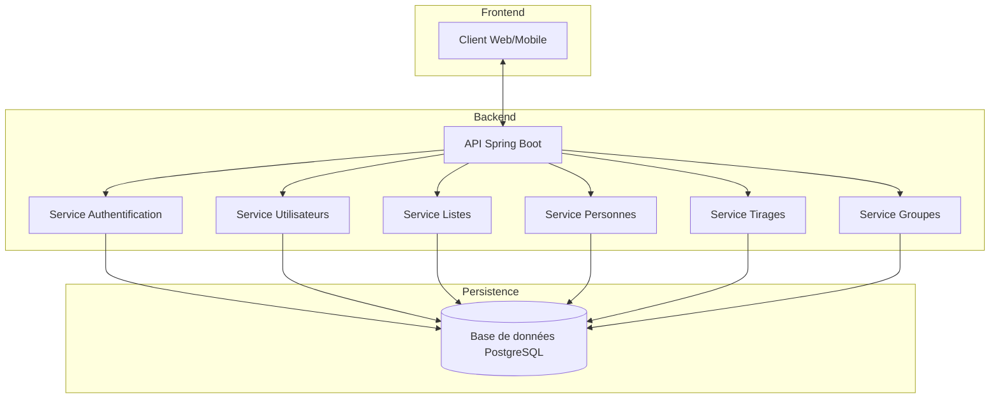

## Bienvenue dans la documentation EasyGroup

EasyGroup est une application pour la création intelligente de groupes d'apprenants à partir de listes partagées, en tenant compte de divers critères (âge, expérience, profils, etc.).

## Fonctionnalités Principales

- [**Gestion des Utilisateurs**](/user-guide/user-management) - Inscription, connexion, gestion des profils utilisateurs.
- [**Gestion des Listes**](/user-guide/list-management) - Création, modification, suppression et partage de listes de personnes.
- [**Gestion des Personnes**](/user-guide/person-management) - Ajout, modification et suppression de personnes avec leurs caractéristiques.
- [**Création de Groupes**](/user-guide/group-creation) - Génération automatique de groupes équilibrés selon divers critères.

## Architecture Globale

L'application EasyGroup est construite selon une architecture moderne et modulaire :

## Stack Technique

- **Backend** : Spring Boot 3.2.0, Java 17
- **Base de données** : PostgreSQL 14
- **Sécurité** : Spring Security avec Argon2id pour le hachage des mots de passe
- **Conteneurisation** : Docker et Docker Compose
- **CI/CD** : GitHub Actions

## Explorer la Documentation

- [**Guide Utilisateur**](/user-guide/) - Apprenez à utiliser l'application EasyGroup.
- [**Documentation Technique**](/technical-docs/) - Explorez l'architecture et les modèles de données.
- [**Récits Utilisateurs**](/user-stories/) - Découvrez les récits utilisateurs et les cas d'utilisation.
- [**Ressources**](/resources/) - Consultez la FAQ, le glossaire et d'autres ressources.
