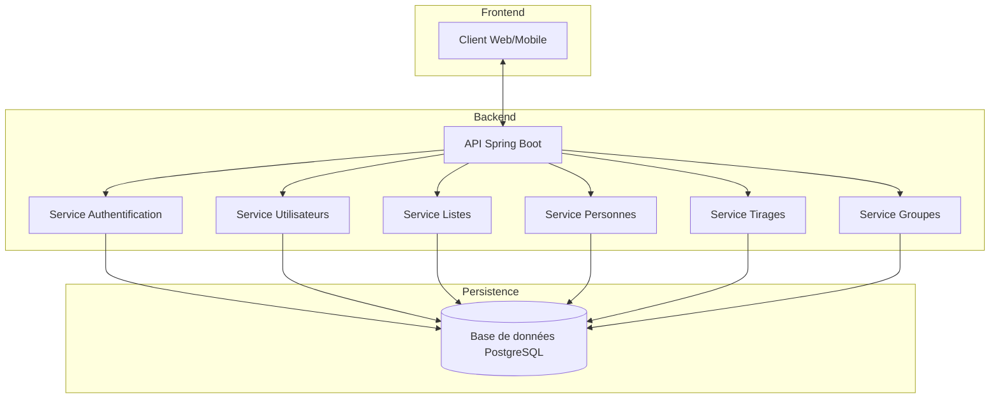
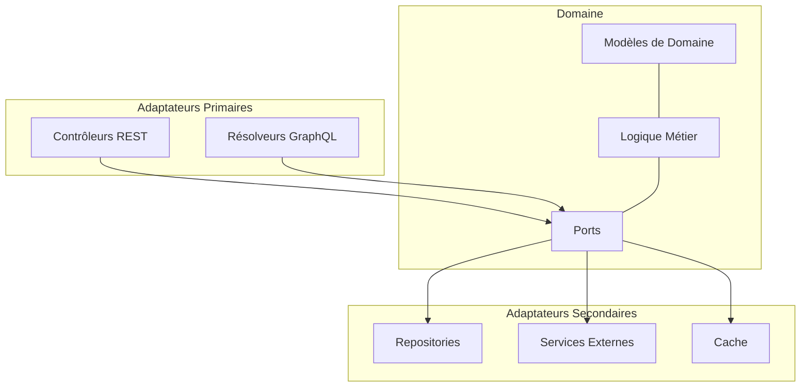
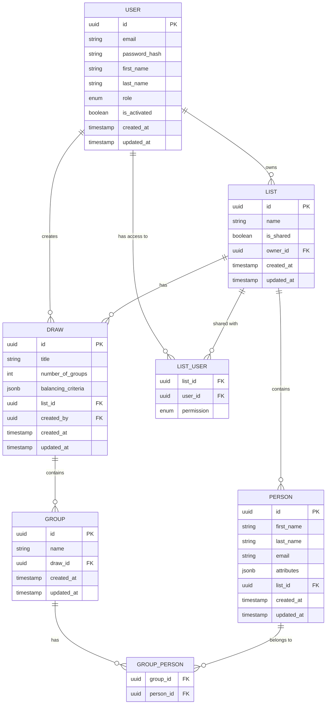

# Architecture de l'API EasyGroup

Cette page décrit l'architecture globale de l'API EasyGroup, ses composants principaux et leurs interactions.

## Vue d'Ensemble

L'API EasyGroup est construite selon une architecture moderne, modulaire et évolutive, basée sur les principes de l'architecture hexagonale (ou architecture en ports et adaptateurs). Cette approche permet une séparation claire des préoccupations et facilite la maintenance, les tests et l'évolution du système.

## Architecture Hexagonale

L'API EasyGroup implémente l'architecture hexagonale, également connue sous le nom d'architecture en ports et adaptateurs ou "Onion Architecture". Cette approche architecturale place le domaine métier au centre du système et définit des interfaces (ports) pour interagir avec le monde extérieur via des adaptateurs.

### Couches de l'Architecture

1. **Couche Domaine** (Cœur)
   - Contient les entités métier et la logique métier
   - Définit les interfaces (ports) pour interagir avec les services externes
   - Indépendante des technologies et frameworks

2. **Couche Application**
   - Implémente les cas d'utilisation en orchestrant les entités du domaine
   - Définit les interfaces pour les adaptateurs primaires
   - Utilise les ports pour interagir avec les adaptateurs secondaires

3. **Couche Adaptateurs**
   - **Adaptateurs Primaires** : Implémentent les interfaces de la couche application (contrôleurs REST, résolveurs GraphQL)
   - **Adaptateurs Secondaires** : Implémentent les ports définis dans le domaine (repositories, services externes)

4. **Couche Infrastructure**
   - Configuration des frameworks et bibliothèques
   - Gestion des dépendances
   - Configuration de la sécurité, de la persistance, etc.

## Composants Principaux

### API Gateway

L'API Gateway est le point d'entrée unique pour toutes les requêtes client. Elle est responsable de :

- Routage des requêtes vers les services appropriés
- Authentification et autorisation
- Validation des requêtes
- Gestion des erreurs
- Documentation de l'API (Swagger/OpenAPI)

### Services Métier

L'API EasyGroup est organisée en services métier, chacun responsable d'un domaine spécifique :

#### Service d'Authentification

Responsable de la gestion de l'authentification et de l'autorisation des utilisateurs.

- Inscription et connexion des utilisateurs
- Gestion des tokens JWT
- Vérification des autorisations

#### Service Utilisateurs

Gère les utilisateurs et leurs profils.

- Création et mise à jour des profils utilisateurs
- Gestion des rôles et permissions
- Récupération des informations utilisateur

#### Service Listes

Gère les listes de personnes.

- Création, modification et suppression de listes
- Partage de listes entre utilisateurs
- Gestion des permissions sur les listes

#### Service Personnes

Gère les personnes et leurs attributs.

- Ajout, modification et suppression de personnes
- Gestion des attributs des personnes
- Recherche et filtrage des personnes

#### Service Tirages

Gère les tirages (génération de groupes).

- Création de tirages à partir de listes
- Configuration des critères de tirage
- Historique des tirages

#### Service Groupes

Gère les groupes générés lors des tirages.

- Création et modification de groupes
- Ajout et suppression de personnes dans les groupes
- Équilibrage des groupes selon divers critères

### Persistence des Données

L'API EasyGroup utilise PostgreSQL comme système de gestion de base de données relationnelle. La persistence des données est gérée via Spring Data JPA, qui fournit une abstraction de haut niveau pour interagir avec la base de données.

## Communication entre Composants

### API REST

La communication entre les clients et l'API se fait via des endpoints REST. L'API suit les principes REST :

- Utilisation appropriée des méthodes HTTP (GET, POST, PUT, DELETE)
- Ressources identifiées par des URLs
- Représentation des ressources en JSON
- Stateless (sans état)
- Utilisation des codes de statut HTTP appropriés

### Communication Interne

La communication entre les différents services se fait via :

- Appels de méthodes directs (dans le contexte d'une application monolithique)
- Événements asynchrones pour certaines opérations (via Spring Events)

## Sécurité

La sécurité est mise en œuvre à plusieurs niveaux :

### Authentification

- Basée sur JWT (JSON Web Tokens)
- Stockage des tokens dans des cookies HTTP-only pour une meilleure protection contre les attaques XSS
- Expiration des tokens après une période définie

### Autorisation

- Contrôle d'accès basé sur les rôles (RBAC)
- Vérification des permissions au niveau des ressources
- Validation des autorisations pour chaque requête

### Protection des Données

- Hachage des mots de passe avec Argon2id
- Validation des entrées pour prévenir les injections
- Protection CSRF
- Utilisation de HTTPS pour toutes les communications

## Scalabilité et Performance

L'architecture de l'API EasyGroup est conçue pour être scalable :

### Scalabilité Horizontale

- Application stateless permettant le déploiement de plusieurs instances
- Utilisation de caches pour améliorer les performances (Redis)
- Possibilité de déployer les services individuellement (si nécessaire)

### Performance

- Pagination des résultats pour les requêtes volumineuses
- Optimisation des requêtes de base de données
- Indexation appropriée des tables
- Mise en cache des données fréquemment accédées

## Monitoring et Logging

L'API intègre des fonctionnalités de monitoring et de logging :

- Actuator endpoints pour la surveillance de l'état de l'application
- Logging structuré pour faciliter l'analyse
- Métriques de performance et d'utilisation
- Traçage des requêtes

## Déploiement

L'API EasyGroup est conçue pour être déployée dans différents environnements :

### Conteneurisation

- Utilisation de Docker pour la conteneurisation
- Docker Compose pour le déploiement local et de développement
- Possibilité de déploiement sur Kubernetes pour les environnements de production à grande échelle

### CI/CD

- Pipeline CI/CD avec GitHub Actions
- Tests automatisés à chaque commit
- Déploiement automatique dans les environnements de développement et de test
- Déploiement manuel dans les environnements de production

## Conclusion

L'architecture de l'API EasyGroup est conçue pour être modulaire, évolutive et maintenable. L'utilisation de l'architecture hexagonale permet une séparation claire des préoccupations et facilite les tests et l'évolution du système. La mise en œuvre de bonnes pratiques en matière de sécurité, de performance et de déploiement garantit une application robuste et fiable.