# Flux Métiers

Cette page documente les principaux flux métiers de l'API EasyGroup, illustrant les interactions entre les différents composants du système et les acteurs externes.

## Authentification et Gestion des Utilisateurs

### Inscription d'un Utilisateur

Le diagramme suivant illustre le processus d'inscription d'un nouvel utilisateur dans le système.

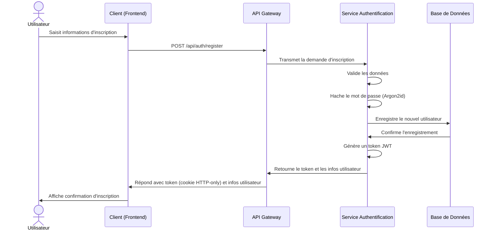

### Connexion d'un Utilisateur

Le diagramme suivant illustre le processus de connexion d'un utilisateur existant.

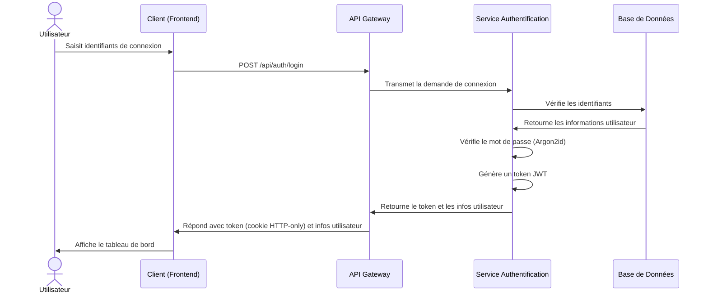

## Gestion des Listes

### Création d'une Liste

Le diagramme suivant illustre le processus de création d'une nouvelle liste.

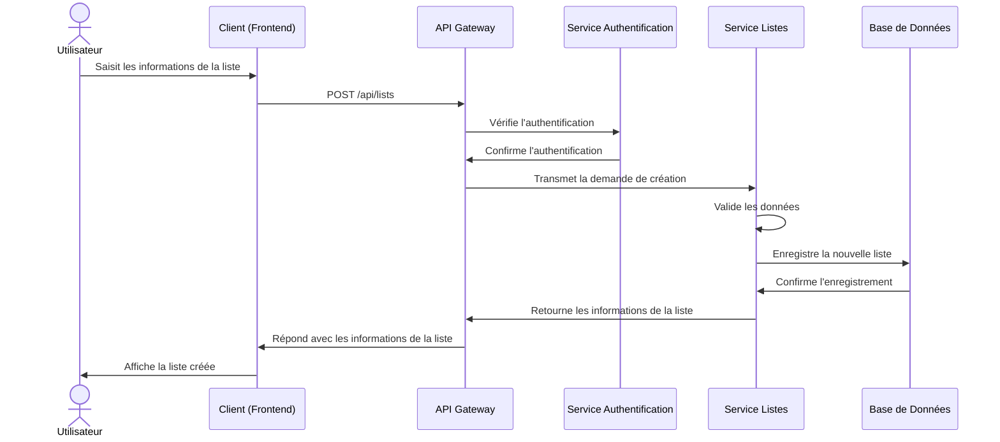

### Partage d'une Liste

Le diagramme suivant illustre le processus de partage d'une liste avec un autre utilisateur.

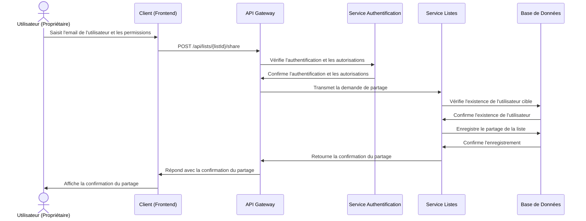

## Gestion des Personnes

### Ajout de Personnes à une Liste

Le diagramme suivant illustre le processus d'ajout de personnes à une liste.

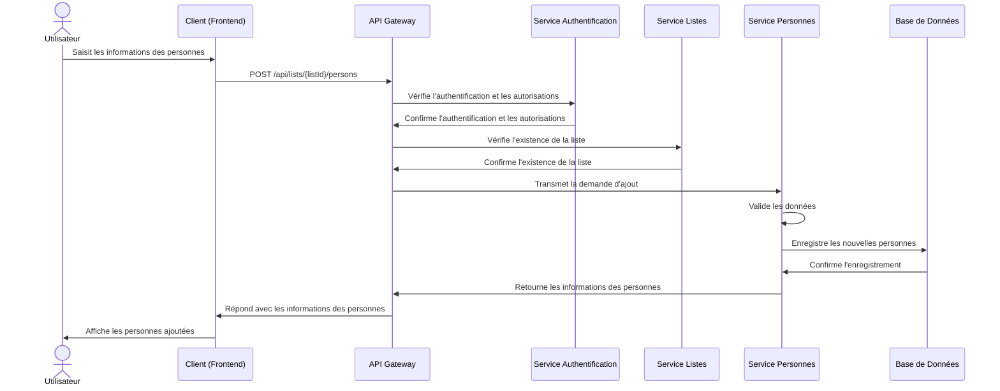

### Importation de Personnes depuis un Fichier

Le diagramme suivant illustre le processus d'importation de personnes depuis un fichier CSV ou Excel.

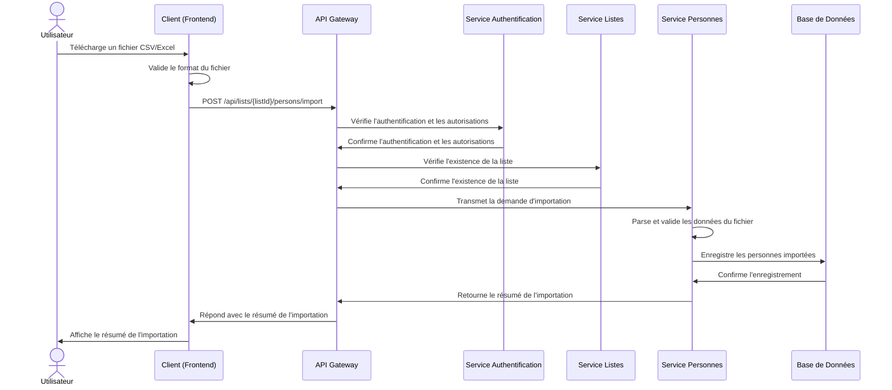

## Création et Gestion des Groupes

### Création de Groupes (Tirage)

Le diagramme suivant illustre le processus de création de groupes à partir d'une liste de personnes.

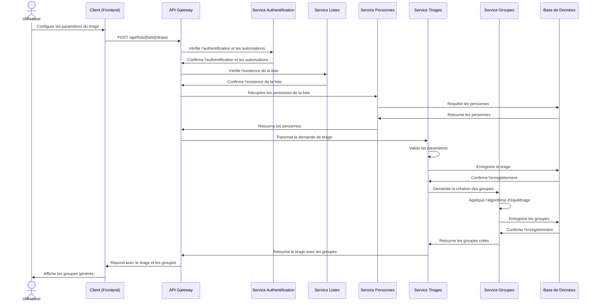

### Modification Manuelle des Groupes

Le diagramme suivant illustre le processus de modification manuelle des groupes après leur création.

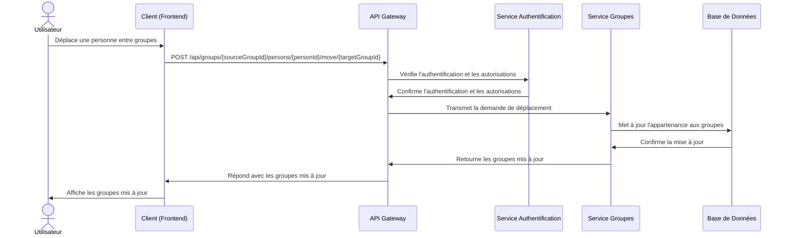

### Rééquilibrage des Groupes

Le diagramme suivant illustre le processus de rééquilibrage automatique des groupes.

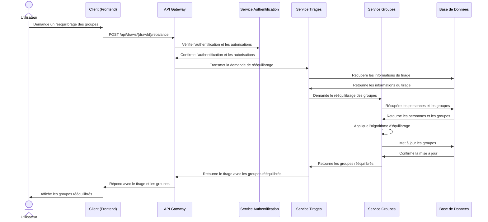

## Exportation des Résultats

### Exportation des Groupes en CSV

Le diagramme suivant illustre le processus d'exportation des groupes au format CSV.

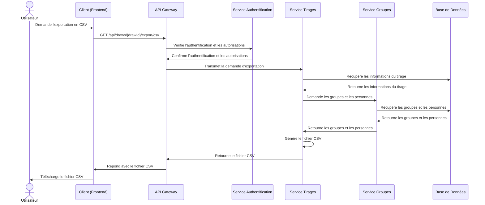

### Exportation des Groupes en PDF

Le diagramme suivant illustre le processus d'exportation des groupes au format PDF.

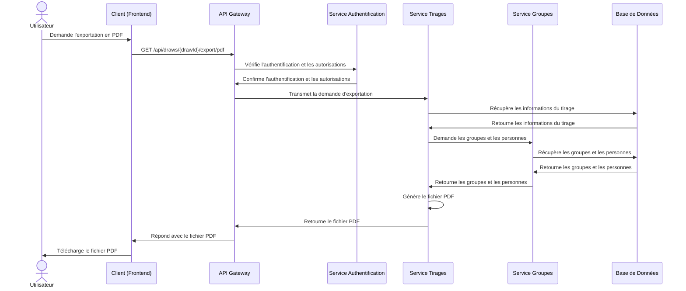

## Algorithme d'Équilibrage des Groupes

L'algorithme d'équilibrage des groupes est un élément central de l'application EasyGroup. Le diagramme suivant illustre le processus d'équilibrage des groupes.

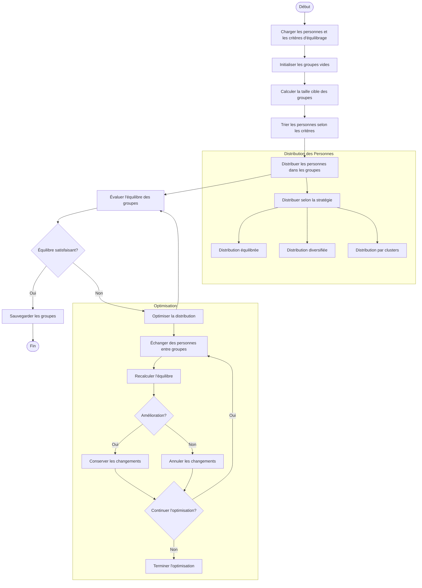

### Stratégies d'Équilibrage

L'API EasyGroup propose plusieurs stratégies d'équilibrage pour répondre à différents besoins :

1. **Distribution Équilibrée (DISTRIBUTE_EVENLY)**
   - Objectif : Répartir les personnes de manière à ce que chaque groupe ait une distribution similaire pour un attribut donné.
   - Exemple : Répartir les personnes de manière à ce que l'âge moyen soit similaire dans tous les groupes.

2. **Diversité Assurée (ENSURE_DIVERSITY)**
   - Objectif : Maximiser la diversité au sein de chaque groupe pour un attribut donné.
   - Exemple : Répartir les personnes de manière à ce que chaque groupe contienne une diversité de compétences.

3. **Regroupement Similaire (CLUSTER_SIMILAR)**
   - Objectif : Regrouper les personnes ayant des attributs similaires.
   - Exemple : Regrouper les personnes ayant un niveau d'expérience similaire.

## Conclusion

Les flux métiers de l'API EasyGroup sont conçus pour offrir une expérience utilisateur fluide et intuitive, tout en garantissant la sécurité et l'intégrité des données. L'architecture modulaire et l'utilisation de services spécialisés permettent une séparation claire des responsabilités et facilitent la maintenance et l'évolution du système.

L'algorithme d'équilibrage des groupes, élément central de l'application, offre une grande flexibilité grâce à ses différentes stratégies et critères configurables, permettant de répondre à une variété de besoins en matière de création de groupes équilibrés.