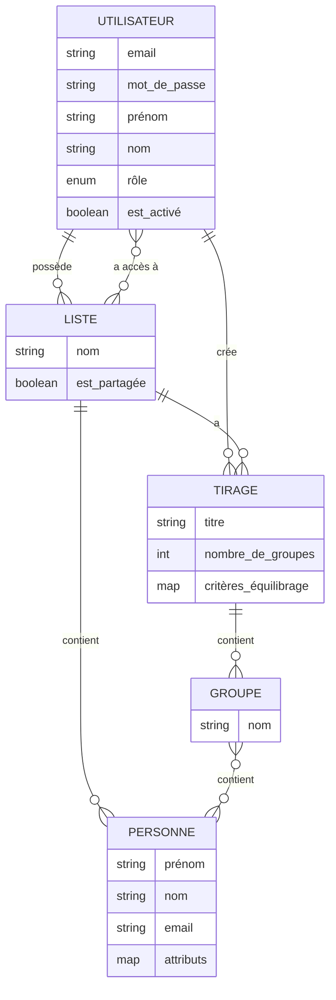
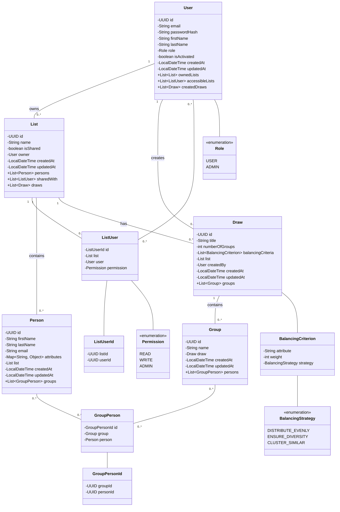

# Modèles de Données

Cette page documente les modèles de données utilisés dans l'API EasyGroup, présentant le Modèle Conceptuel de Données (MCD), le Modèle Logique de Données (MLD) et le Modèle Physique de Données (MPD).

## Modèle Conceptuel de Données (MCD)

Le Modèle Conceptuel de Données représente les entités métier et leurs relations, indépendamment de toute considération technique.



### Description des Entités

#### UTILISATEUR
Représente un utilisateur du système.
- **email** : Adresse email de l'utilisateur (identifiant unique)
- **mot_de_passe** : Mot de passe haché de l'utilisateur
- **prénom** : Prénom de l'utilisateur
- **nom** : Nom de famille de l'utilisateur
- **rôle** : Rôle de l'utilisateur (USER, ADMIN)
- **est_activé** : Indique si le compte utilisateur est actif

#### LISTE
Représente une liste de personnes.
- **nom** : Nom de la liste
- **est_partagée** : Indique si la liste est partagée avec d'autres utilisateurs

#### PERSONNE
Représente une personne dans une liste.
- **prénom** : Prénom de la personne
- **nom** : Nom de famille de la personne
- **email** : Adresse email de la personne
- **attributs** : Map d'attributs dynamiques (âge, expérience, compétences, etc.)

#### TIRAGE
Représente un tirage (génération de groupes) à partir d'une liste.
- **titre** : Titre du tirage
- **nombre_de_groupes** : Nombre de groupes à générer
- **critères_équilibrage** : Critères utilisés pour équilibrer les groupes

#### GROUPE
Représente un groupe généré lors d'un tirage.
- **nom** : Nom du groupe

### Description des Relations

- Un **UTILISATEUR** peut posséder plusieurs **LISTE**s
- Un **UTILISATEUR** peut créer plusieurs **TIRAGE**s
- Un **UTILISATEUR** peut avoir accès à plusieurs **LISTE**s partagées
- Une **LISTE** peut être partagée avec plusieurs **UTILISATEUR**s
- Une **LISTE** contient plusieurs **PERSONNE**s
- Une **LISTE** peut avoir plusieurs **TIRAGE**s
- Un **TIRAGE** contient plusieurs **GROUPE**s
- Un **GROUPE** contient plusieurs **PERSONNE**s
- Une **PERSONNE** peut appartenir à plusieurs **GROUPE**s

## Modèle Logique de Données (MLD)

Le Modèle Logique de Données traduit le MCD en structures de données relationnelles.

```
UTILISATEUR (id, email, mot_de_passe_hash, prénom, nom, rôle, est_activé, créé_le, modifié_le)
Clé primaire : id

LISTE (id, nom, est_partagée, propriétaire_id, créé_le, modifié_le)
Clé primaire : id
Clé étrangère : propriétaire_id référence UTILISATEUR(id)

LISTE_UTILISATEUR (liste_id, utilisateur_id, permission)
Clé primaire : (liste_id, utilisateur_id)
Clé étrangère : liste_id référence LISTE(id)
Clé étrangère : utilisateur_id référence UTILISATEUR(id)

PERSONNE (id, prénom, nom, email, attributs, liste_id, créé_le, modifié_le)
Clé primaire : id
Clé étrangère : liste_id référence LISTE(id)

TIRAGE (id, titre, nombre_de_groupes, critères_équilibrage, liste_id, créé_par, créé_le, modifié_le)
Clé primaire : id
Clé étrangère : liste_id référence LISTE(id)
Clé étrangère : créé_par référence UTILISATEUR(id)

GROUPE (id, nom, tirage_id, créé_le, modifié_le)
Clé primaire : id
Clé étrangère : tirage_id référence TIRAGE(id)

GROUPE_PERSONNE (groupe_id, personne_id)
Clé primaire : (groupe_id, personne_id)
Clé étrangère : groupe_id référence GROUPE(id)
Clé étrangère : personne_id référence PERSONNE(id)
```

## Modèle Physique de Données (MPD)

Le Modèle Physique de Données décrit l'implémentation concrète du MLD dans la base de données PostgreSQL.

```sql
CREATE TABLE users (
    id UUID PRIMARY KEY DEFAULT gen_random_uuid(),
    email VARCHAR(255) NOT NULL UNIQUE,
    password_hash VARCHAR(255) NOT NULL,
    first_name VARCHAR(100) NOT NULL,
    last_name VARCHAR(100) NOT NULL,
    role VARCHAR(20) NOT NULL DEFAULT 'USER',
    is_activated BOOLEAN NOT NULL DEFAULT TRUE,
    created_at TIMESTAMP NOT NULL DEFAULT CURRENT_TIMESTAMP,
    updated_at TIMESTAMP NOT NULL DEFAULT CURRENT_TIMESTAMP,
    CONSTRAINT chk_role CHECK (role IN ('USER', 'ADMIN'))
);

CREATE TABLE lists (
    id UUID PRIMARY KEY DEFAULT gen_random_uuid(),
    name VARCHAR(255) NOT NULL,
    is_shared BOOLEAN NOT NULL DEFAULT FALSE,
    owner_id UUID NOT NULL,
    created_at TIMESTAMP NOT NULL DEFAULT CURRENT_TIMESTAMP,
    updated_at TIMESTAMP NOT NULL DEFAULT CURRENT_TIMESTAMP,
    FOREIGN KEY (owner_id) REFERENCES users(id) ON DELETE CASCADE
);

CREATE TABLE list_users (
    list_id UUID NOT NULL,
    user_id UUID NOT NULL,
    permission VARCHAR(20) NOT NULL DEFAULT 'READ',
    PRIMARY KEY (list_id, user_id),
    FOREIGN KEY (list_id) REFERENCES lists(id) ON DELETE CASCADE,
    FOREIGN KEY (user_id) REFERENCES users(id) ON DELETE CASCADE,
    CONSTRAINT chk_permission CHECK (permission IN ('READ', 'WRITE', 'ADMIN'))
);

CREATE TABLE persons (
    id UUID PRIMARY KEY DEFAULT gen_random_uuid(),
    first_name VARCHAR(100) NOT NULL,
    last_name VARCHAR(100) NOT NULL,
    email VARCHAR(255),
    attributes JSONB NOT NULL DEFAULT '{}',
    list_id UUID NOT NULL,
    created_at TIMESTAMP NOT NULL DEFAULT CURRENT_TIMESTAMP,
    updated_at TIMESTAMP NOT NULL DEFAULT CURRENT_TIMESTAMP,
    FOREIGN KEY (list_id) REFERENCES lists(id) ON DELETE CASCADE
);

CREATE TABLE draws (
    id UUID PRIMARY KEY DEFAULT gen_random_uuid(),
    title VARCHAR(255) NOT NULL,
    number_of_groups INTEGER NOT NULL,
    balancing_criteria JSONB NOT NULL DEFAULT '[]',
    list_id UUID NOT NULL,
    created_by UUID NOT NULL,
    created_at TIMESTAMP NOT NULL DEFAULT CURRENT_TIMESTAMP,
    updated_at TIMESTAMP NOT NULL DEFAULT CURRENT_TIMESTAMP,
    FOREIGN KEY (list_id) REFERENCES lists(id) ON DELETE CASCADE,
    FOREIGN KEY (created_by) REFERENCES users(id) ON DELETE CASCADE,
    CONSTRAINT chk_number_of_groups CHECK (number_of_groups > 0)
);

CREATE TABLE groups (
    id UUID PRIMARY KEY DEFAULT gen_random_uuid(),
    name VARCHAR(255) NOT NULL,
    draw_id UUID NOT NULL,
    created_at TIMESTAMP NOT NULL DEFAULT CURRENT_TIMESTAMP,
    updated_at TIMESTAMP NOT NULL DEFAULT CURRENT_TIMESTAMP,
    FOREIGN KEY (draw_id) REFERENCES draws(id) ON DELETE CASCADE
);

CREATE TABLE group_persons (
    group_id UUID NOT NULL,
    person_id UUID NOT NULL,
    PRIMARY KEY (group_id, person_id),
    FOREIGN KEY (group_id) REFERENCES groups(id) ON DELETE CASCADE,
    FOREIGN KEY (person_id) REFERENCES persons(id) ON DELETE CASCADE
);

-- Indexes
CREATE INDEX idx_lists_owner_id ON lists(owner_id);
CREATE INDEX idx_persons_list_id ON persons(list_id);
CREATE INDEX idx_draws_list_id ON draws(list_id);
CREATE INDEX idx_draws_created_by ON draws(created_by);
CREATE INDEX idx_groups_draw_id ON groups(draw_id);
CREATE INDEX idx_persons_email ON persons(email);
CREATE INDEX idx_persons_attributes ON persons USING GIN (attributes);
CREATE INDEX idx_draws_balancing_criteria ON draws USING GIN (balancing_criteria);
```

## Structure des Données JSONB

### Attributs des Personnes

Les attributs des personnes sont stockés dans un champ JSONB, permettant une grande flexibilité dans la définition des caractéristiques des personnes.

Exemple de structure d'attributs :

```json
{
  "age": 30,
  "experience": "intermediate",
  "skills": ["java", "spring", "react"],
  "languages": ["french", "english"],
  "profile": "A_LAISE",
  "oldDwwm": false,
  "frenchLevel": 3,
  "techLevel": 2
}
```

### Critères d'Équilibrage

Les critères d'équilibrage pour les tirages sont également stockés dans un champ JSONB.

Exemple de structure de critères d'équilibrage :

```json
[
  {
    "attribute": "age",
    "weight": 2,
    "strategy": "DISTRIBUTE_EVENLY"
  },
  {
    "attribute": "experience",
    "weight": 3,
    "strategy": "DISTRIBUTE_EVENLY"
  },
  {
    "attribute": "skills",
    "weight": 1,
    "strategy": "ENSURE_DIVERSITY"
  }
]
```

## Diagramme de Classes (Entités JPA)

Le diagramme suivant représente les entités JPA utilisées dans l'application :



## Contraintes et Règles Métier

### Contraintes d'Intégrité

1. **Unicité des emails utilisateurs** : Chaque utilisateur doit avoir une adresse email unique.
2. **Intégrité référentielle** : Toutes les relations entre les tables sont maintenues par des contraintes de clé étrangère.
3. **Validation des rôles** : Les rôles des utilisateurs sont limités aux valeurs définies (USER, ADMIN).
4. **Validation des permissions** : Les permissions sur les listes partagées sont limitées aux valeurs définies (READ, WRITE, ADMIN).
5. **Nombre de groupes positif** : Le nombre de groupes dans un tirage doit être supérieur à zéro.

### Règles Métier

1. **Suppression en cascade** : La suppression d'une entité parent entraîne la suppression de toutes ses entités enfants.
2. **Propriété des listes** : Chaque liste appartient à un utilisateur spécifique.
3. **Partage de listes** : Une liste peut être partagée avec d'autres utilisateurs avec différents niveaux de permission.
4. **Appartenance des personnes** : Chaque personne appartient à une liste spécifique.
5. **Appartenance des groupes** : Chaque groupe appartient à un tirage spécifique.
6. **Appartenance des tirages** : Chaque tirage est associé à une liste spécifique et créé par un utilisateur spécifique.

## Évolution du Modèle de Données

Le modèle de données est conçu pour être évolutif :

1. **Attributs dynamiques** : L'utilisation de JSONB pour les attributs des personnes permet d'ajouter de nouveaux attributs sans modifier le schéma de la base de données.
2. **Critères d'équilibrage flexibles** : L'utilisation de JSONB pour les critères d'équilibrage permet d'ajouter de nouveaux critères et stratégies sans modifier le schéma.
3. **Extensibilité** : Le modèle peut être étendu pour prendre en charge de nouvelles fonctionnalités, comme des modèles de tirage prédéfinis, des statistiques sur les tirages, etc.

## Conclusion

Le modèle de données de l'API EasyGroup est conçu pour être flexible, évolutif et performant. L'utilisation de PostgreSQL avec ses fonctionnalités avancées comme JSONB permet de stocker des données structurées et non structurées de manière efficace. Les contraintes d'intégrité et les règles métier garantissent la cohérence des données, tandis que les index optimisent les performances des requêtes.