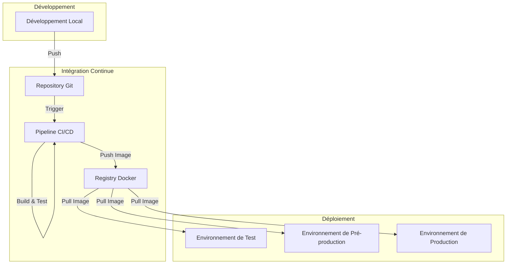
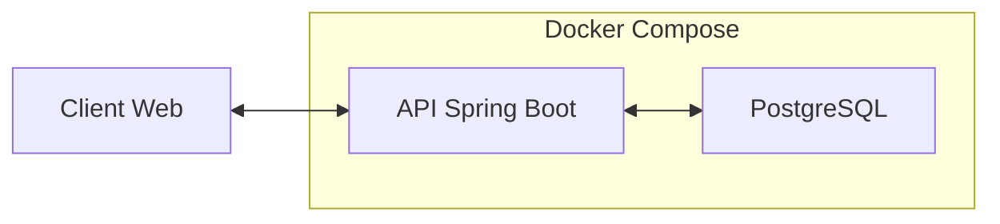
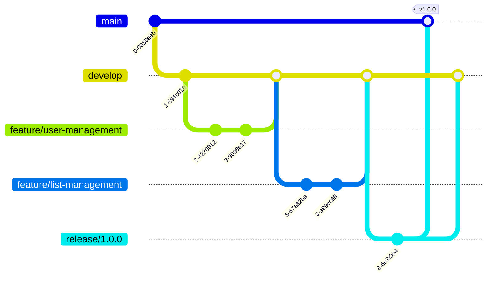

# Déploiement et CI/CD

Cette page documente les processus de déploiement et d'intégration continue/déploiement continu (CI/CD) de l'API EasyGroup.

## Vue d'Ensemble du Déploiement

L'API EasyGroup est conçue pour être déployée dans différents environnements, du développement local à la production, en utilisant des conteneurs Docker. Le diagramme suivant illustre l'architecture de déploiement :



## Conteneurisation avec Docker

### Structure des Conteneurs

L'API EasyGroup utilise une architecture multi-conteneurs pour isoler les différents composants de l'application :



### Dockerfile

Le Dockerfile suivant est utilisé pour construire l'image Docker de l'API EasyGroup :

```dockerfile
# Étape de build
FROM maven:3.8.6-openjdk-17-slim AS build
WORKDIR /app
COPY pom.xml .
# Téléchargement des dépendances
RUN mvn dependency:go-offline
COPY src ./src
# Construction du JAR
RUN mvn package -DskipTests

# Étape de runtime
FROM eclipse-temurin:17-jre-alpine
WORKDIR /app
# Copie du JAR depuis l'étape de build
COPY --from=build /app/target/*.jar app.jar
# Variables d'environnement par défaut
ENV SPRING_PROFILES_ACTIVE=prod
ENV DB_HOST=postgres
ENV DB_PORT=5432
ENV DB_NAME=easygroup
ENV DB_USERNAME=easygroup
ENV DB_PASSWORD=easygroup
ENV APP_PORT=8080
# Exposition du port
EXPOSE 8080
# Commande de démarrage
ENTRYPOINT ["java", "-jar", "app.jar"]
```

### Docker Compose

Le fichier `docker-compose.yml` suivant est utilisé pour déployer l'application en environnement de développement ou de test :

```yaml
version: '3.8'

services:
  app:
    build: .
    ports:
      - "${APP_PORT:-8080}:8080"
    environment:
      - SPRING_PROFILES_ACTIVE=${SPRING_PROFILES_ACTIVE:-dev}
      - DB_HOST=postgres
      - DB_PORT=5432
      - DB_NAME=${DB_NAME:-easygroup}
      - DB_USERNAME=${DB_USERNAME:-easygroup}
      - DB_PASSWORD=${DB_PASSWORD:-easygroup}
      - JWT_SECRET=${JWT_SECRET:-devSecretKey}
      - JWT_EXPIRATION=${JWT_EXPIRATION:-86400}
    depends_on:
      - postgres
    networks:
      - easygroup-network
    restart: unless-stopped

  postgres:
    image: postgres:14-alpine
    ports:
      - "${DB_PORT:-5432}:5432"
    environment:
      - POSTGRES_DB=${DB_NAME:-easygroup}
      - POSTGRES_USER=${DB_USERNAME:-easygroup}
      - POSTGRES_PASSWORD=${DB_PASSWORD:-easygroup}
    volumes:
      - postgres-data:/var/lib/postgresql/data
    networks:
      - easygroup-network
    restart: unless-stopped

networks:
  easygroup-network:
    driver: bridge

volumes:
  postgres-data:
```

### Docker Compose pour la Production

Pour l'environnement de production, un fichier `docker-compose.prod.yml` plus sécurisé est utilisé :

```yaml
version: '3.8'

services:
  app:
    image: ${DOCKER_REGISTRY}/easygroup-api:${APP_VERSION}
    ports:
      - "${APP_PORT:-8080}:8080"
    environment:
      - SPRING_PROFILES_ACTIVE=prod
      - DB_HOST=postgres
      - DB_PORT=5432
      - DB_NAME=${DB_NAME}
      - DB_USERNAME=${DB_USERNAME}
      - DB_PASSWORD=${DB_PASSWORD}
      - JWT_SECRET=${JWT_SECRET}
      - JWT_EXPIRATION=${JWT_EXPIRATION:-86400}
    depends_on:
      - postgres
    networks:
      - easygroup-network
    restart: unless-stopped
    deploy:
      replicas: 2
      update_config:
        parallelism: 1
        delay: 10s
        order: start-first
      resources:
        limits:
          cpus: '1'
          memory: 1G
    healthcheck:
      test: ["CMD", "curl", "-f", "http://localhost:8080/actuator/health"]
      interval: 30s
      timeout: 10s
      retries: 3
      start_period: 40s

  postgres:
    image: postgres:14-alpine
    environment:
      - POSTGRES_DB=${DB_NAME}
      - POSTGRES_USER=${DB_USERNAME}
      - POSTGRES_PASSWORD=${DB_PASSWORD}
    volumes:
      - postgres-data:/var/lib/postgresql/data
    networks:
      - easygroup-network
    restart: unless-stopped
    deploy:
      resources:
        limits:
          cpus: '1'
          memory: 1G
    healthcheck:
      test: ["CMD-SHELL", "pg_isready -U ${DB_USERNAME} -d ${DB_NAME}"]
      interval: 10s
      timeout: 5s
      retries: 5
      start_period: 10s

networks:
  easygroup-network:
    driver: bridge

volumes:
  postgres-data:
    driver: local
    driver_opts:
      type: none
      o: bind
      device: /data/postgres
```

## Environnements de Déploiement

### Environnement de Développement Local

Pour le développement local, les développeurs peuvent utiliser Docker Compose ou exécuter l'application directement avec Maven :

#### Avec Maven

```bash
# Démarrer PostgreSQL avec Docker
docker run -d --name postgres -p 5432:5432 \
  -e POSTGRES_DB=easygroup \
  -e POSTGRES_USER=easygroup \
  -e POSTGRES_PASSWORD=easygroup \
  postgres:14-alpine

# Démarrer l'application
./mvnw spring-boot:run -Dspring-boot.run.profiles=dev
```

#### Avec Docker Compose

```bash
# Créer un fichier .env avec les variables d'environnement
echo "SPRING_PROFILES_ACTIVE=dev" > .env
echo "DB_NAME=easygroup" >> .env
echo "DB_USERNAME=easygroup" >> .env
echo "DB_PASSWORD=easygroup" >> .env
echo "JWT_SECRET=devSecretKey" >> .env

# Démarrer l'application avec Docker Compose
docker-compose up -d
```

### Environnement de Test

L'environnement de test est automatiquement déployé après chaque push sur la branche `develop` :

```bash
# Déploiement sur l'environnement de test
docker-compose -f docker-compose.yml -f docker-compose.test.yml up -d
```

### Environnement de Pré-production

L'environnement de pré-production est déployé après validation manuelle dans le pipeline CI/CD :

```bash
# Déploiement sur l'environnement de pré-production
docker-compose -f docker-compose.yml -f docker-compose.staging.yml up -d
```

### Environnement de Production

L'environnement de production est déployé après validation manuelle dans le pipeline CI/CD :

```bash
# Déploiement sur l'environnement de production
docker-compose -f docker-compose.yml -f docker-compose.prod.yml up -d
```

## Configuration des Environnements

### Variables d'Environnement

L'API EasyGroup utilise des variables d'environnement pour configurer les différents environnements :

| Variable | Description | Valeur par défaut |
|----------|-------------|-------------------|
| `SPRING_PROFILES_ACTIVE` | Profil Spring actif | `dev` |
| `DB_HOST` | Hôte de la base de données | `localhost` |
| `DB_PORT` | Port de la base de données | `5432` |
| `DB_NAME` | Nom de la base de données | `easygroup` |
| `DB_USERNAME` | Nom d'utilisateur de la base de données | `easygroup` |
| `DB_PASSWORD` | Mot de passe de la base de données | `easygroup` |
| `JWT_SECRET` | Clé secrète pour les tokens JWT | Généré aléatoirement |
| `JWT_EXPIRATION` | Durée de validité des tokens JWT (en secondes) | `86400` (24 heures) |
| `APP_PORT` | Port sur lequel l'application s'exécute | `8080` |

### Profils Spring Boot

L'API EasyGroup utilise les profils Spring Boot pour configurer les différents environnements :

- `dev` : Environnement de développement local
- `test` : Environnement de test
- `staging` : Environnement de pré-production
- `prod` : Environnement de production

Chaque profil a sa propre configuration dans les fichiers `application-{profile}.properties` :

#### application-dev.properties

```properties
# Configuration de la base de données
spring.datasource.url=jdbc:postgresql://${DB_HOST:localhost}:${DB_PORT:5432}/${DB_NAME:easygroup}
spring.datasource.username=${DB_USERNAME:easygroup}
spring.datasource.password=${DB_PASSWORD:easygroup}

# Configuration JPA
spring.jpa.hibernate.ddl-auto=update
spring.jpa.show-sql=true
spring.jpa.properties.hibernate.format_sql=true

# Configuration de la sécurité
jwt.secret=${JWT_SECRET:devSecretKey}
jwt.expiration=${JWT_EXPIRATION:86400}

# Configuration des logs
logging.level.root=INFO
logging.level.com.easygroup=DEBUG
logging.level.org.springframework.web=DEBUG
logging.level.org.hibernate.SQL=DEBUG

# Configuration Actuator
management.endpoints.web.exposure.include=health,info,metrics
```

#### application-prod.properties

```properties
# Configuration de la base de données
spring.datasource.url=jdbc:postgresql://${DB_HOST}:${DB_PORT}/${DB_NAME}
spring.datasource.username=${DB_USERNAME}
spring.datasource.password=${DB_PASSWORD}

# Configuration JPA
spring.jpa.hibernate.ddl-auto=none
spring.jpa.show-sql=false

# Configuration de la sécurité
jwt.secret=${JWT_SECRET}
jwt.expiration=${JWT_EXPIRATION:86400}

# Configuration des logs
logging.level.root=WARN
logging.level.com.easygroup=INFO

# Configuration Actuator
management.endpoints.web.exposure.include=health,info
management.endpoint.health.show-details=when_authorized
```

## Intégration Continue et Déploiement Continu (CI/CD)

### Pipeline CI/CD avec GitHub Actions

L'API EasyGroup utilise GitHub Actions pour l'intégration continue et le déploiement continu. Le workflow est défini dans le fichier `.github/workflows/ci-cd.yml` :

```yaml
name: CI/CD Pipeline

on:
  push:
    branches: [ main, develop ]
  pull_request:
    branches: [ main, develop ]

jobs:
  build:
    runs-on: ubuntu-latest
    steps:
      - uses: actions/checkout@v3
      
      - name: Set up JDK 17
        uses: actions/setup-java@v3
        with:
          java-version: '17'
          distribution: 'temurin'
          cache: maven
      
      - name: Build with Maven
        run: mvn -B package --file pom.xml
      
      - name: Run tests
        run: mvn test
      
      - name: Run integration tests
        run: mvn verify -P integration-test
      
      - name: Build Docker image
        run: docker build -t easygroup-api:${{ github.sha }} .
      
      - name: Save Docker image
        run: docker save easygroup-api:${{ github.sha }} > easygroup-api.tar
      
      - name: Upload Docker image as artifact
        uses: actions/upload-artifact@v3
        with:
          name: docker-image
          path: easygroup-api.tar
  
  deploy-test:
    needs: build
    if: github.ref == 'refs/heads/develop'
    runs-on: ubuntu-latest
    environment: test
    steps:
      - uses: actions/checkout@v3
      
      - name: Download Docker image
        uses: actions/download-artifact@v3
        with:
          name: docker-image
      
      - name: Load Docker image
        run: docker load < easygroup-api.tar
      
      - name: Login to Docker Registry
        uses: docker/login-action@v2
        with:
          registry: ${{ secrets.DOCKER_REGISTRY }}
          username: ${{ secrets.DOCKER_USERNAME }}
          password: ${{ secrets.DOCKER_PASSWORD }}
      
      - name: Tag and push Docker image
        run: |
          docker tag easygroup-api:${{ github.sha }} ${{ secrets.DOCKER_REGISTRY }}/easygroup-api:test
          docker push ${{ secrets.DOCKER_REGISTRY }}/easygroup-api:test
      
      - name: Deploy to Test Environment
        uses: appleboy/ssh-action@master
        with:
          host: ${{ secrets.TEST_HOST }}
          username: ${{ secrets.TEST_USERNAME }}
          key: ${{ secrets.TEST_SSH_KEY }}
          script: |
            cd /opt/easygroup
            echo "APP_VERSION=test" > .env
            echo "DB_NAME=${{ secrets.DB_NAME }}" >> .env
            echo "DB_USERNAME=${{ secrets.DB_USERNAME }}" >> .env
            echo "DB_PASSWORD=${{ secrets.DB_PASSWORD }}" >> .env
            echo "JWT_SECRET=${{ secrets.JWT_SECRET }}" >> .env
            echo "DOCKER_REGISTRY=${{ secrets.DOCKER_REGISTRY }}" >> .env
            docker-compose -f docker-compose.yml -f docker-compose.test.yml pull
            docker-compose -f docker-compose.yml -f docker-compose.test.yml up -d
  
  deploy-staging:
    needs: deploy-test
    if: github.ref == 'refs/heads/develop'
    runs-on: ubuntu-latest
    environment: staging
    steps:
      - uses: actions/checkout@v3
      
      - name: Download Docker image
        uses: actions/download-artifact@v3
        with:
          name: docker-image
      
      - name: Load Docker image
        run: docker load < easygroup-api.tar
      
      - name: Login to Docker Registry
        uses: docker/login-action@v2
        with:
          registry: ${{ secrets.DOCKER_REGISTRY }}
          username: ${{ secrets.DOCKER_USERNAME }}
          password: ${{ secrets.DOCKER_PASSWORD }}
      
      - name: Tag and push Docker image
        run: |
          docker tag easygroup-api:${{ github.sha }} ${{ secrets.DOCKER_REGISTRY }}/easygroup-api:staging
          docker push ${{ secrets.DOCKER_REGISTRY }}/easygroup-api:staging
      
      - name: Deploy to Staging Environment
        uses: appleboy/ssh-action@master
        with:
          host: ${{ secrets.STAGING_HOST }}
          username: ${{ secrets.STAGING_USERNAME }}
          key: ${{ secrets.STAGING_SSH_KEY }}
          script: |
            cd /opt/easygroup
            echo "APP_VERSION=staging" > .env
            echo "DB_NAME=${{ secrets.DB_NAME }}" >> .env
            echo "DB_USERNAME=${{ secrets.DB_USERNAME }}" >> .env
            echo "DB_PASSWORD=${{ secrets.DB_PASSWORD }}" >> .env
            echo "JWT_SECRET=${{ secrets.JWT_SECRET }}" >> .env
            echo "DOCKER_REGISTRY=${{ secrets.DOCKER_REGISTRY }}" >> .env
            docker-compose -f docker-compose.yml -f docker-compose.staging.yml pull
            docker-compose -f docker-compose.yml -f docker-compose.staging.yml up -d
  
  deploy-production:
    needs: build
    if: github.ref == 'refs/heads/main'
    runs-on: ubuntu-latest
    environment: production
    steps:
      - uses: actions/checkout@v3
      
      - name: Download Docker image
        uses: actions/download-artifact@v3
        with:
          name: docker-image
      
      - name: Load Docker image
        run: docker load < easygroup-api.tar
      
      - name: Login to Docker Registry
        uses: docker/login-action@v2
        with:
          registry: ${{ secrets.DOCKER_REGISTRY }}
          username: ${{ secrets.DOCKER_USERNAME }}
          password: ${{ secrets.DOCKER_PASSWORD }}
      
      - name: Tag and push Docker image
        run: |
          docker tag easygroup-api:${{ github.sha }} ${{ secrets.DOCKER_REGISTRY }}/easygroup-api:latest
          docker tag easygroup-api:${{ github.sha }} ${{ secrets.DOCKER_REGISTRY }}/easygroup-api:${{ github.sha }}
          docker push ${{ secrets.DOCKER_REGISTRY }}/easygroup-api:latest
          docker push ${{ secrets.DOCKER_REGISTRY }}/easygroup-api:${{ github.sha }}
      
      - name: Deploy to Production Environment
        uses: appleboy/ssh-action@master
        with:
          host: ${{ secrets.PROD_HOST }}
          username: ${{ secrets.PROD_USERNAME }}
          key: ${{ secrets.PROD_SSH_KEY }}
          script: |
            cd /opt/easygroup
            echo "APP_VERSION=${{ github.sha }}" > .env
            echo "DB_NAME=${{ secrets.DB_NAME }}" >> .env
            echo "DB_USERNAME=${{ secrets.DB_USERNAME }}" >> .env
            echo "DB_PASSWORD=${{ secrets.DB_PASSWORD }}" >> .env
            echo "JWT_SECRET=${{ secrets.JWT_SECRET }}" >> .env
            echo "DOCKER_REGISTRY=${{ secrets.DOCKER_REGISTRY }}" >> .env
            docker-compose -f docker-compose.yml -f docker-compose.prod.yml pull
            docker-compose -f docker-compose.yml -f docker-compose.prod.yml up -d
```

### Stratégie de Branchement

L'API EasyGroup utilise la stratégie de branchement GitFlow :



- **main** : Branche de production, contient le code déployé en production
- **develop** : Branche de développement, contient le code en cours de développement
- **feature/*** : Branches de fonctionnalités, créées à partir de `develop`
- **release/*** : Branches de release, créées à partir de `develop` pour préparer une release
- **hotfix/*** : Branches de correctifs, créées à partir de `main` pour corriger des bugs en production

## Monitoring et Logging

### Monitoring avec Spring Boot Actuator

L'API EasyGroup utilise Spring Boot Actuator pour exposer des endpoints de monitoring :

- `/actuator/health` : État de santé de l'application
- `/actuator/info` : Informations sur l'application
- `/actuator/metrics` : Métriques de l'application

### Logging

L'API EasyGroup utilise Logback pour la journalisation :

```xml
<?xml version="1.0" encoding="UTF-8"?>
<configuration>
    <include resource="org/springframework/boot/logging/logback/defaults.xml"/>
    <include resource="org/springframework/boot/logging/logback/console-appender.xml"/>
    
    <springProperty scope="context" name="appName" source="spring.application.name" defaultValue="easygroup-api"/>
    <springProperty scope="context" name="appProfile" source="spring.profiles.active" defaultValue="dev"/>
    
    <property name="LOG_FILE" value="${LOG_PATH:-/var/log/easygroup}/${appName}-${appProfile}.log"/>
    
    <appender name="FILE" class="ch.qos.logback.core.rolling.RollingFileAppender">
        <file>${LOG_FILE}</file>
        <rollingPolicy class="ch.qos.logback.core.rolling.TimeBasedRollingPolicy">
            <fileNamePattern>${LOG_FILE}.%d{yyyy-MM-dd}.gz</fileNamePattern>
            <maxHistory>30</maxHistory>
        </rollingPolicy>
        <encoder>
            <pattern>%d{yyyy-MM-dd HH:mm:ss.SSS} [%thread] %-5level %logger{36} - %msg%n</pattern>
        </encoder>
    </appender>
    
    <root level="INFO">
        <appender-ref ref="CONSOLE"/>
        <appender-ref ref="FILE"/>
    </root>
    
    <logger name="com.easygroup" level="DEBUG" additivity="false">
        <appender-ref ref="CONSOLE"/>
        <appender-ref ref="FILE"/>
    </logger>
</configuration>
```

## Sauvegarde et Restauration

### Sauvegarde de la Base de Données

L'API EasyGroup utilise des scripts de sauvegarde automatique pour la base de données PostgreSQL :

```bash
#!/bin/bash
# Script de sauvegarde de la base de données

# Charger les variables d'environnement
source /opt/easygroup/.env

# Définir les variables
BACKUP_DIR="/backup/postgres"
TIMESTAMP=$(date +%Y%m%d_%H%M%S)
BACKUP_FILE="$BACKUP_DIR/easygroup_$TIMESTAMP.sql"

# Créer le répertoire de sauvegarde s'il n'existe pas
mkdir -p $BACKUP_DIR

# Effectuer la sauvegarde
docker exec -t easygroup_postgres pg_dump -U $DB_USERNAME -d $DB_NAME > $BACKUP_FILE

# Compresser la sauvegarde
gzip $BACKUP_FILE

# Supprimer les sauvegardes de plus de 30 jours
find $BACKUP_DIR -name "easygroup_*.sql.gz" -type f -mtime +30 -delete

# Afficher un message de confirmation
echo "Sauvegarde terminée : ${BACKUP_FILE}.gz"
```

### Restauration de la Base de Données

```bash
#!/bin/bash
# Script de restauration de la base de données

# Charger les variables d'environnement
source /opt/easygroup/.env

# Vérifier les arguments
if [ $# -ne 1 ]; then
    echo "Usage: $0 <backup_file>"
    exit 1
fi

BACKUP_FILE=$1

# Vérifier que le fichier existe
if [ ! -f $BACKUP_FILE ]; then
    echo "Le fichier de sauvegarde $BACKUP_FILE n'existe pas."
    exit 1
fi

# Décompresser le fichier si nécessaire
if [[ $BACKUP_FILE == *.gz ]]; then
    gunzip -c $BACKUP_FILE > ${BACKUP_FILE%.gz}
    BACKUP_FILE=${BACKUP_FILE%.gz}
fi

# Restaurer la base de données
echo "Restauration de la base de données à partir de $BACKUP_FILE..."
docker exec -i easygroup_postgres psql -U $DB_USERNAME -d $DB_NAME < $BACKUP_FILE

# Afficher un message de confirmation
echo "Restauration terminée."
```

## Conclusion

Le déploiement de l'API EasyGroup est conçu pour être flexible, sécurisé et automatisé. L'utilisation de Docker et Docker Compose permet de déployer l'application dans différents environnements de manière cohérente, tandis que le pipeline CI/CD avec GitHub Actions automatise le processus de build, de test et de déploiement.

La configuration par environnement via les profils Spring Boot et les variables d'environnement permet d'adapter l'application à différents contextes d'exécution, du développement local à la production.

Les mécanismes de monitoring, de logging et de sauvegarde garantissent la fiabilité et la résilience de l'application en production.