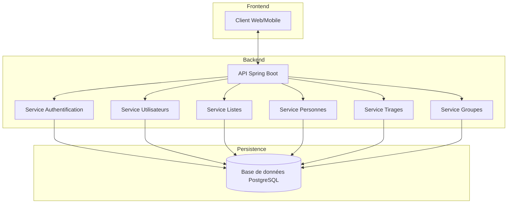

# Documentation Technique

Cette section fournit une documentation technique détaillée de l'API EasyGroup, couvrant l'architecture, les modèles de données, les flux métiers, la sécurité et le déploiement.

## Contenu de la Documentation Technique

La documentation technique est organisée en plusieurs sections :

- [Architecture](./architecture) - Description de l'architecture globale du système
- [Modèles de Données](./data-models) - Documentation des modèles de données (MCD, MLD, MPD)
- [Flux Métiers](./business-flows) - Description des principaux flux métiers de l'application
- [Sécurité](./security) - Documentation des mécanismes de sécurité et d'authentification
- [Déploiement](./deployment) - Guide de déploiement et configuration CI/CD

## Architecture Globale

L'application EasyGroup est construite selon une architecture moderne et modulaire :

## Stack Technique

EasyGroup utilise une stack technique moderne et robuste :

- **Backend** : Spring Boot 3.2.0, Java 17
- **Base de données** : PostgreSQL 14
- **Sécurité** : Spring Security avec Argon2id pour le hachage des mots de passe
- **Conteneurisation** : Docker et Docker Compose
- **CI/CD** : GitHub Actions
- **Documentation API** : OpenAPI 3.0 (Swagger)
- **Tests** : JUnit 5, Mockito, Testcontainers

## Principes de Conception

L'API EasyGroup a été conçue selon les principes suivants :

### Architecture Hexagonale

L'application suit les principes de l'architecture hexagonale (ou architecture en ports et adaptateurs) :

- **Domaine** : Contient les entités métier et la logique métier
- **Ports** : Définit les interfaces pour interagir avec le domaine
- **Adaptateurs** : Implémente les interfaces pour connecter le domaine au monde extérieur

### API RESTful

L'API suit les principes REST :

- Utilisation appropriée des méthodes HTTP (GET, POST, PUT, DELETE)
- Ressources identifiées par des URLs
- Représentation des ressources en JSON
- Stateless (sans état)
- Utilisation des codes de statut HTTP appropriés

### Sécurité

La sécurité est une priorité :

- Authentification basée sur JWT
- Hachage des mots de passe avec Argon2id
- Protection CSRF
- Validation des entrées
- Gestion fine des autorisations

## Modèles de Données

Les principaux modèles de données de l'application sont :

- **User** : Représente un utilisateur du système
- **List** : Représente une liste de personnes
- **Person** : Représente une personne avec ses attributs
- **Draw** : Représente un tirage (génération de groupes)
- **Group** : Représente un groupe de personnes

Pour plus de détails sur les modèles de données, consultez la [documentation des modèles de données](./data-models).

## Flux Métiers

Les principaux flux métiers de l'application sont :

1. **Inscription et Authentification** : Processus d'inscription et de connexion des utilisateurs
2. **Gestion des Listes** : Création, modification et partage de listes de personnes
3. **Gestion des Personnes** : Ajout, modification et suppression de personnes dans les listes
4. **Création de Groupes** : Génération automatique de groupes équilibrés selon divers critères
5. **Exportation des Résultats** : Exportation des groupes générés dans différents formats

Pour plus de détails sur les flux métiers, consultez la [documentation des flux métiers](./business-flows).

## Déploiement

L'application peut être déployée de plusieurs façons :

- **Développement Local** : Exécution avec Maven ou Docker Compose
- **Production** : Déploiement avec Docker et Docker Compose
- **CI/CD** : Pipeline automatisé avec GitHub Actions

Pour plus de détails sur le déploiement, consultez le [guide de déploiement](./deployment).