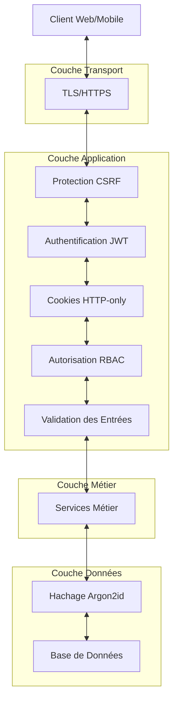

# Sécurité et Authentification

Cette page documente les mécanismes de sécurité et d'authentification mis en œuvre dans l'API EasyGroup.

## Architecture de Sécurité

L'API EasyGroup implémente une architecture de sécurité robuste basée sur les meilleures pratiques de l'industrie. Le diagramme suivant illustre les différentes couches de sécurité de l'application :



## Authentification

### Mécanisme d'Authentification par JWT

L'API EasyGroup utilise JSON Web Tokens (JWT) pour l'authentification des utilisateurs. Les tokens JWT sont stockés dans des cookies HTTP-only pour une meilleure protection contre les attaques XSS (Cross-Site Scripting).

#### Structure des Tokens JWT

Les tokens JWT utilisés par l'API EasyGroup sont composés de trois parties :

1. **Header** : Contient le type de token et l'algorithme de signature
   ```json
   {
     "alg": "HS256",
     "typ": "JWT"
   }
   ```

2. **Payload** : Contient les claims (revendications) du token
   ```json
   {
     "sub": "550e8400-e29b-41d4-a716-446655440000",
     "name": "Prénom Nom",
     "email": "utilisateur@exemple.com",
     "role": "USER",
     "iat": 1516239022,
     "exp": 1516242622
   }
   ```

   Le payload contient les informations suivantes:
   - `sub`: ID de l'utilisateur
   - `iat`: Date d'émission du token
   - `exp`: Date d'expiration du token

3. **Signature** : Garantit l'intégrité du token
   ```
   HMACSHA256(
     base64UrlEncode(header) + "." +
     base64UrlEncode(payload),
     secret
   )
   ```

#### Cycle de Vie des Tokens

1. **Émission** : Un token JWT est émis lors de l'inscription ou de la connexion d'un utilisateur
2. **Stockage** : Le token est stocké dans un cookie HTTP-only
3. **Utilisation** : Le token est automatiquement envoyé avec chaque requête
4. **Validation** : Le token est validé à chaque requête
5. **Expiration** : Le token expire après une période définie (par défaut : 24 heures)
6. **Révocation** : Le token est supprimé lors de la déconnexion

### Cookies HTTP-only

Les tokens JWT sont stockés dans des cookies HTTP-only, ce qui offre plusieurs avantages en termes de sécurité :

- **Protection contre les attaques XSS** : Les cookies HTTP-only ne sont pas accessibles via JavaScript, ce qui empêche les attaquants d'exécuter du code malveillant pour voler les tokens
- **Gestion automatique par le navigateur** : Les cookies sont automatiquement envoyés avec chaque requête
- **Expiration configurable** : Les cookies peuvent être configurés pour expirer après une période définie

#### Configuration des Cookies

Les cookies utilisés par l'API EasyGroup sont configurés avec les attributs suivants :

```
Set-Cookie: JWT_TOKEN=eyJhbGciOiJIUzI1NiIsInR5cCI6IkpXVCJ9...; 
           Path=/; 
           HttpOnly; 
           Secure; 
           SameSite=Strict; 
           Max-Age=86400
```

- **HttpOnly** : Empêche l'accès au cookie via JavaScript
- **Secure** : Le cookie n'est envoyé que sur des connexions HTTPS
- **SameSite=Strict** : Le cookie n'est pas envoyé lors des requêtes cross-site
- **Path=/** : Le cookie est disponible pour tout le domaine
- **Max-Age=86400** : Le cookie expire après 24 heures

### Hachage des Mots de Passe avec Argon2id

L'API EasyGroup utilise l'algorithme Argon2id pour le hachage des mots de passe, qui est considéré comme l'un des algorithmes les plus sécurisés actuellement disponibles. Argon2id a remporté la compétition Password Hashing Competition en 2015 et offre une excellente protection contre les attaques par force brute, y compris celles utilisant des GPU ou des ASIC.

#### Configuration d'Argon2id

L'algorithme Argon2id est configuré avec les paramètres suivants :

- **Longueur du sel** : 16 octets
- **Longueur du hachage** : 32 octets
- **Itérations** : 3
- **Mémoire** : 64 Mo
- **Parallélisme** : 4 threads

Cette configuration offre un bon équilibre entre sécurité et performance, rendant les attaques par force brute extrêmement coûteuses en termes de ressources.

#### Exemple de Hachage

```java
public class PasswordHashingExample {
    public static void main(String[] args) {
        // Configuration d'Argon2id
        int iterations = 3;
        int memory = 64 * 1024; // 64 Mo
        int parallelism = 4;
        int hashLength = 32;
        int saltLength = 16;

        SecureRandom secureRandom = new SecureRandom();
        String password = "motDePasse123!";

        // Génération d'un sel aléatoire
        byte[] salt = new byte[saltLength];
        secureRandom.nextBytes(salt);

        // Hachage du mot de passe
        Argon2Parameters parameters = new Argon2Parameters.Builder(Argon2Parameters.ARGON2_id)
            .withIterations(iterations)
            .withMemoryAsKB(memory)
            .withParallelism(parallelism)
            .withSalt(salt)
            .build();

        Argon2BytesGenerator generator = new Argon2BytesGenerator();
        generator.init(parameters);

        byte[] hash = new byte[hashLength];
        generator.generateBytes(password.getBytes(StandardCharsets.UTF_8), hash);

        // Stockage du hachage et du sel
        String encodedHash = Base64.getEncoder().encodeToString(hash);
        String encodedSalt = Base64.getEncoder().encodeToString(salt);

        System.out.println("Hachage: " + encodedHash);
        System.out.println("Sel: " + encodedSalt);
    }
}
```

## Autorisation

### Contrôle d'Accès Basé sur les Rôles (RBAC)

L'API EasyGroup implémente un système de contrôle d'accès basé sur les rôles (RBAC) pour gérer les autorisations des utilisateurs. Ce système permet de définir précisément quelles actions sont autorisées pour chaque rôle.

#### Rôles Disponibles

- **USER** : Utilisateur standard
- **ADMIN** : Administrateur avec des privilèges étendus

#### Matrice des Permissions

| Ressource | Action | USER | ADMIN |
|-----------|--------|------|-------|
| Utilisateur | Voir son profil | ✅ | ✅ |
| Utilisateur | Modifier son profil | ✅ | ✅ |
| Utilisateur | Voir tous les utilisateurs | ❌ | ✅ |
| Utilisateur | Modifier tous les utilisateurs | ❌ | ✅ |
| Liste | Créer une liste | ✅ | ✅ |
| Liste | Voir ses listes | ✅ | ✅ |
| Liste | Modifier ses listes | ✅ | ✅ |
| Liste | Supprimer ses listes | ✅ | ✅ |
| Liste | Voir toutes les listes | ❌ | ✅ |
| Liste | Modifier toutes les listes | ❌ | ✅ |
| Liste | Supprimer toutes les listes | ❌ | ✅ |
| Personne | Ajouter des personnes à ses listes | ✅ | ✅ |
| Personne | Modifier des personnes dans ses listes | ✅ | ✅ |
| Personne | Supprimer des personnes de ses listes | ✅ | ✅ |
| Tirage | Créer un tirage à partir de ses listes | ✅ | ✅ |
| Tirage | Voir ses tirages | ✅ | ✅ |
| Tirage | Modifier ses tirages | ✅ | ✅ |
| Tirage | Supprimer ses tirages | ✅ | ✅ |
| Tirage | Voir tous les tirages | ❌ | ✅ |
| Tirage | Modifier tous les tirages | ❌ | ✅ |
| Tirage | Supprimer tous les tirages | ❌ | ✅ |

### Permissions sur les Listes Partagées

En plus du RBAC, l'API EasyGroup implémente un système de permissions pour les listes partagées. Ce système permet de définir précisément quelles actions sont autorisées pour chaque utilisateur sur une liste partagée.

#### Permissions Disponibles

- **READ** : Permet de voir la liste et son contenu
- **WRITE** : Permet de modifier la liste et son contenu
- **ADMIN** : Permet de gérer la liste, son contenu et ses partages

#### Matrice des Permissions sur les Listes Partagées

| Action | READ | WRITE | ADMIN | Propriétaire |
|--------|------|-------|-------|-------------|
| Voir la liste | ✅ | ✅ | ✅ | ✅ |
| Voir les personnes | ✅ | ✅ | ✅ | ✅ |
| Ajouter des personnes | ❌ | ✅ | ✅ | ✅ |
| Modifier des personnes | ❌ | ✅ | ✅ | ✅ |
| Supprimer des personnes | ❌ | ✅ | ✅ | ✅ |
| Créer un tirage | ✅ | ✅ | ✅ | ✅ |
| Modifier la liste | ❌ | ✅ | ✅ | ✅ |
| Supprimer la liste | ❌ | ❌ | ❌ | ✅ |
| Partager la liste | ❌ | ❌ | ✅ | ✅ |
| Gérer les partages | ❌ | ❌ | ✅ | ✅ |

### Implémentation des Autorisations

L'API EasyGroup implémente les autorisations à plusieurs niveaux :

1. **Niveau Contrôleur** : Utilisation des annotations `@PreAuthorize` de Spring Security pour vérifier les autorisations avant l'exécution des méthodes
2. **Niveau Service** : Vérification des autorisations dans les services métier
3. **Niveau Base de Données** : Utilisation de requêtes qui filtrent les résultats en fonction des autorisations de l'utilisateur

#### Exemple d'Implémentation au Niveau Contrôleur

```java
@RestController
@RequestMapping("/api/lists")
public class ListController {

    @GetMapping("/{id}")
    @PreAuthorize("@listAuthorizationService.canView(#id, principal)")
    public ResponseEntity<ListDto> getList(@PathVariable UUID id) {
        // ...
    }

    @PutMapping("/{id}")
    @PreAuthorize("@listAuthorizationService.canEdit(#id, principal)")
    public ResponseEntity<ListDto> updateList(@PathVariable UUID id, @RequestBody ListUpdateRequest request) {
        // ...
    }

    @DeleteMapping("/{id}")
    @PreAuthorize("@listAuthorizationService.canDelete(#id, principal)")
    public ResponseEntity<Void> deleteList(@PathVariable UUID id) {
        // ...
    }
}
```

#### Exemple d'Implémentation au Niveau Service

```java
@Service
public class ListAuthorizationService {

    private final ListRepository listRepository;
    private final ListUserRepository listUserRepository;

    public boolean canView(UUID listId, UserDetails userDetails) {
        if (isAdmin(userDetails)) {
            return true;
        }

        UUID userId = getUserId(userDetails);
        List list = listRepository.findById(listId).orElse(null);

        if (list == null) {
            return false;
        }

        if (list.getOwner().getId().equals(userId)) {
            return true;
        }

        return listUserRepository.findByListIdAndUserId(listId, userId)
            .map(listUser -> true)
            .orElse(false);
    }

    public boolean canEdit(UUID listId, UserDetails userDetails) {
        if (isAdmin(userDetails)) {
            return true;
        }

        UUID userId = getUserId(userDetails);
        List list = listRepository.findById(listId).orElse(null);

        if (list == null) {
            return false;
        }

        if (list.getOwner().getId().equals(userId)) {
            return true;
        }

        return listUserRepository.findByListIdAndUserId(listId, userId)
            .map(listUser -> listUser.getPermission() == Permission.WRITE || 
                             listUser.getPermission() == Permission.ADMIN)
            .orElse(false);
    }

    public boolean canDelete(UUID listId, UserDetails userDetails) {
        if (isAdmin(userDetails)) {
            return true;
        }

        UUID userId = getUserId(userDetails);
        List list = listRepository.findById(listId).orElse(null);

        if (list == null) {
            return false;
        }

        return list.getOwner().getId().equals(userId);
    }

    private boolean isAdmin(UserDetails userDetails) {
        return userDetails.getAuthorities().stream()
            .anyMatch(a -> a.getAuthority().equals("ROLE_ADMIN"));
    }

    private UUID getUserId(UserDetails userDetails) {
        if (userDetails instanceof CustomUserDetails) {
            return ((CustomUserDetails) userDetails).getId();
        }
        throw new IllegalArgumentException("UserDetails must be of type CustomUserDetails");
    }
}
```

## Protection contre les Attaques Courantes

### Protection CSRF

L'API EasyGroup implémente une protection contre les attaques CSRF (Cross-Site Request Forgery) en utilisant le mécanisme de token CSRF de Spring Security.

#### Configuration de la Protection CSRF

```java
@Configuration
@EnableWebSecurity
public class SecurityConfig {

    @Bean
    public SecurityFilterChain securityFilterChain(HttpSecurity http) throws Exception {
        http
            .csrf(csrf -> csrf
                .csrfTokenRepository(CookieCsrfTokenRepository.withHttpOnlyFalse())
                .csrfTokenRequestHandler(new CsrfTokenRequestAttributeHandler())
            );
        // ...
        return http.build();
    }
}
```

### Protection contre les Injections

L'API EasyGroup implémente plusieurs mécanismes pour se protéger contre les injections :

1. **Validation des Entrées** : Utilisation de Bean Validation pour valider les données d'entrée
2. **Requêtes Préparées** : Utilisation de requêtes préparées avec JPA/Hibernate pour prévenir les injections SQL
3. **Échappement des Sorties** : Échappement des données avant de les renvoyer au client

#### Exemple de Validation des Entrées

```java
public class UserRegistrationRequest {

    @NotBlank(message = "L'email est obligatoire")
    @Email(message = "L'email doit être valide")
    private String email;

    @NotBlank(message = "Le mot de passe est obligatoire")
    @Size(min = 8, message = "Le mot de passe doit contenir au moins 8 caractères")
    @Pattern(regexp = "^(?=.*[0-9])(?=.*[a-z])(?=.*[A-Z])(?=.*[@#$%^&+=]).*$",
             message = "Le mot de passe doit contenir au moins un chiffre, une minuscule, une majuscule et un caractère spécial")
    private String password;

    @NotBlank(message = "Le prénom est obligatoire")
    private String firstName;

    @NotBlank(message = "Le nom est obligatoire")
    private String lastName;
}
```

### Protection contre les Attaques XSS

L'API EasyGroup implémente plusieurs mécanismes pour se protéger contre les attaques XSS (Cross-Site Scripting) :

1. **Cookies HTTP-only** : Les tokens JWT sont stockés dans des cookies HTTP-only, inaccessibles via JavaScript
2. **Content Security Policy (CSP)** : Configuration d'une politique de sécurité du contenu pour limiter les sources de contenu
3. **Échappement des Sorties** : Échappement des données avant de les renvoyer au client

#### Configuration de la Content Security Policy

```java
@Configuration
public class WebConfig implements WebMvcConfigurer {

    @Override
    public void addInterceptors(InterceptorRegistry registry) {
        registry.addInterceptor(new HandlerInterceptor() {
            @Override
            public boolean preHandle(HttpServletRequest request, HttpServletResponse response, Object handler) {
                response.setHeader("Content-Security-Policy", 
                    "default-src 'self'; " +
                    "script-src 'self'; " +
                    "style-src 'self'; " +
                    "img-src 'self'; " +
                    "font-src 'self'; " +
                    "connect-src 'self'");
                return true;
            }
        });
    }
}
```

## Journalisation et Audit

L'API EasyGroup implémente un système de journalisation et d'audit pour suivre les activités des utilisateurs et détecter les comportements suspects.

### Journalisation des Événements de Sécurité

Les événements de sécurité suivants sont journalisés :

- Tentatives de connexion (réussies et échouées)
- Modifications de mot de passe
- Modifications des rôles et permissions
- Accès aux ressources sensibles
- Modifications des données sensibles

#### Exemple de Journalisation

```java
@Service
public class AuthenticationService {

    private static final Logger logger = LoggerFactory.getLogger(AuthenticationService.class);

    public AuthenticationResponse login(LoginRequest request) {
        try {
            // Tentative d'authentification
            // ...

            logger.info("Connexion réussie pour l'utilisateur: {}", request.getEmail());
            return response;
        } catch (BadCredentialsException e) {
            logger.warn("Tentative de connexion échouée pour l'utilisateur: {}", request.getEmail());
            throw e;
        }
    }
}
```

### Audit des Modifications

Les modifications des données sensibles sont auditées pour permettre de suivre qui a fait quoi et quand.

#### Exemple d'Audit avec Spring Data JPA Auditing

```java
@Entity
@Table(name = "users")
@EntityListeners(AuditingEntityListener.class)
public class User {

    @Id
    @GeneratedValue
    private UUID id;

    private String email;
    private String passwordHash;
    private String firstName;
    private String lastName;

    @Enumerated(EnumType.STRING)
    private Role role;

    private boolean isActivated;

    @CreatedDate
    @Column(nullable = false, updatable = false)
    private LocalDateTime createdAt;

    @LastModifiedDate
    @Column(nullable = false)
    private LocalDateTime updatedAt;

    @CreatedBy
    @Column(nullable = false, updatable = false)
    private String createdBy;

    @LastModifiedBy
    @Column(nullable = false)
    private String lastModifiedBy;
}
```

## Bonnes Pratiques de Sécurité

L'API EasyGroup suit les bonnes pratiques de sécurité suivantes :

### Gestion des Secrets

- Les secrets (clés JWT, identifiants de base de données, etc.) sont stockés dans des variables d'environnement ou des coffres-forts de secrets
- Les secrets ne sont jamais commités dans le code source
- Les secrets sont régulièrement renouvelés

### Mises à Jour de Sécurité

- Les dépendances sont régulièrement mises à jour pour corriger les vulnérabilités connues
- Les vulnérabilités sont surveillées via des outils comme OWASP Dependency Check
- Les correctifs de sécurité sont appliqués dès que possible

### Tests de Sécurité

- Des tests de sécurité automatisés sont exécutés dans le pipeline CI/CD
- Des audits de sécurité sont régulièrement effectués
- Des tests de pénétration sont réalisés avant les déploiements majeurs

## Conclusion

La sécurité est une priorité pour l'API EasyGroup. L'application implémente de nombreux mécanismes de sécurité pour protéger les données des utilisateurs et garantir l'intégrité du système. L'utilisation de technologies modernes comme JWT, Argon2id et Spring Security, combinée à des bonnes pratiques de développement sécurisé, permet d'offrir un niveau de sécurité élevé.

La sécurité étant un processus continu, l'API EasyGroup est régulièrement mise à jour pour intégrer les dernières avancées en matière de sécurité et corriger les vulnérabilités qui pourraient être découvertes.
