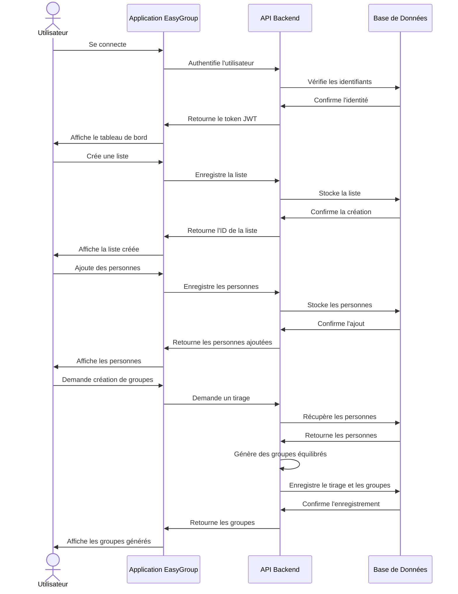

# Guide Utilisateur de l'API EasyGroup

Bienvenue dans le guide utilisateur de l'API EasyGroup. Cette section vous aidera à comprendre comment utiliser les différentes fonctionnalités de l'API pour gérer les utilisateurs, les listes, les personnes et les groupes.

## Vue d'ensemble

L'API EasyGroup offre plusieurs fonctionnalités principales :

- **Gestion des utilisateurs** : Création, modification et suppression de comptes utilisateurs
- **Gestion des listes** : Création, modification, suppression et partage de listes de personnes
- **Gestion des personnes** : Ajout, modification et suppression de personnes avec leurs caractéristiques
- **Création de groupes** : Génération automatique de groupes équilibrés selon divers critères

## Contenu de cette section

Dans cette section, vous trouverez les guides suivants :

- [**Gestion des utilisateurs**](/user-guide/user-management) - Comment gérer les comptes utilisateurs
- [**Gestion des listes**](/user-guide/list-management) - Comment créer et gérer des listes de personnes
- [**Gestion des personnes**](/user-guide/person-management) - Comment ajouter et gérer des personnes dans vos listes
- [**Création de groupes**](/user-guide/group-creation) - Comment générer des groupes équilibrés à partir de vos listes

## Flux de travail typique

Un flux de travail typique avec l'API EasyGroup se déroule généralement comme suit :

1. **Authentification** : L'utilisateur s'authentifie auprès de l'API
2. **Création d'une liste** : L'utilisateur crée une nouvelle liste pour un projet ou un événement
3. **Ajout de personnes** : L'utilisateur ajoute des personnes à la liste avec leurs caractéristiques
4. **Génération de groupes** : L'utilisateur génère des groupes équilibrés à partir de la liste
5. **Consultation des groupes** : L'utilisateur consulte les groupes générés et peut les exporter ou les partager

Le diagramme ci-dessous illustre ce flux de travail :

## Concepts clés

### Listes

Une liste est un ensemble de personnes que vous souhaitez organiser en groupes. Chaque liste a un propriétaire (l'utilisateur qui l'a créée) et peut être partagée avec d'autres utilisateurs.

### Personnes

Une personne est un individu ajouté à une liste. Chaque personne possède des attributs (âge, expérience, compétences, etc.) qui peuvent être utilisés pour équilibrer les groupes.

### Attributs

Les attributs sont des caractéristiques associées à une personne. Ils peuvent être de différents types :
- **Numériques** : Âge, années d'expérience, etc.
- **Catégoriels** : Niveau d'expérience (débutant, intermédiaire, expert), rôle, etc.
- **Listes** : Compétences, langues parlées, etc.

### Tirages

Un tirage est une opération qui génère des groupes à partir d'une liste de personnes. Chaque tirage est enregistré et peut être consulté ultérieurement.

### Groupes

Un groupe est un ensemble de personnes généré lors d'un tirage. Les groupes sont équilibrés en fonction des attributs spécifiés lors du tirage.

## Bonnes pratiques

### Organisation des listes

- Créez des listes distinctes pour différents projets ou événements
- Utilisez des descriptions claires pour faciliter l'identification des listes
- Archivez les listes que vous n'utilisez plus au lieu de les supprimer

### Gestion des personnes

- Incluez suffisamment d'attributs pour permettre un équilibrage efficace des groupes
- Utilisez des attributs cohérents pour toutes les personnes d'une même liste
- Vérifiez l'exactitude des données avant de générer des groupes

### Création de groupes

- Spécifiez les attributs les plus importants pour l'équilibrage
- Testez différentes tailles de groupe pour trouver la configuration optimale
- Enregistrez plusieurs tirages avec des paramètres différents pour comparer les résultats

## Étapes suivantes

Pour commencer à utiliser l'API EasyGroup, consultez le guide de [Gestion des utilisateurs](/user-guide/user-management).