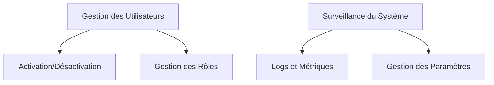

# Récits d'Administration

Cette page présente les récits utilisateurs liés à l'administration de la plateforme EasyGroup. Ces fonctionnalités sont généralement réservées aux utilisateurs ayant le rôle ADMIN.

## Vue d'Ensemble

Les fonctionnalités d'administration permettent de gérer les utilisateurs, les rôles, et de surveiller le système.

## Gestion des Utilisateurs

### US-ADMIN-01: Consultation de la Liste des Utilisateurs

**En tant qu'administrateur, je veux pouvoir consulter la liste de tous les utilisateurs afin de gérer les comptes.**

**Priorité** : Élevée  
**Statut** : Terminé

**Critères d'Acceptation** :
1. L'administrateur peut voir la liste de tous les utilisateurs inscrits
2. Pour chaque utilisateur, l'email, le nom, le prénom, la date d'inscription et le statut d'activation sont affichés
3. L'administrateur peut filtrer les utilisateurs par statut d'activation, rôle, ou date d'inscription
4. L'administrateur peut rechercher un utilisateur par email, nom ou prénom

**Notes Techniques** :
- Une pagination est implémentée pour gérer un grand nombre d'utilisateurs
- Les données sensibles comme les mots de passe ne sont jamais exposées

### US-ADMIN-02: Activation/Désactivation d'un Compte Utilisateur

**En tant qu'administrateur, je veux pouvoir activer ou désactiver un compte utilisateur afin de contrôler l'accès à la plateforme.**

**Priorité** : Élevée  
**Statut** : Terminé

**Critères d'Acceptation** :
1. L'administrateur peut activer un compte utilisateur désactivé
2. L'administrateur peut désactiver un compte utilisateur actif
3. Un utilisateur désactivé ne peut plus se connecter à la plateforme
4. L'administrateur ne peut pas désactiver son propre compte
5. Un message de confirmation est affiché après l'activation/désactivation réussie

**Notes Techniques** :
- La désactivation d'un compte ne supprime pas les données de l'utilisateur
- Le champ isActivated est mis à jour dans la table User
- Les tokens JWT existants pour un utilisateur désactivé sont invalidés

### US-ADMIN-03: Modification du Rôle d'un Utilisateur

**En tant qu'administrateur, je veux pouvoir modifier le rôle d'un utilisateur afin de lui donner ou retirer des privilèges.**

**Priorité** : Élevée  
**Statut** : Terminé

**Critères d'Acceptation** :
1. L'administrateur peut promouvoir un utilisateur standard au rôle d'administrateur
2. L'administrateur peut rétrograder un administrateur au rôle d'utilisateur standard
3. L'administrateur ne peut pas modifier son propre rôle
4. Un message de confirmation est affiché après la modification réussie

**Notes Techniques** :
- Le champ role est mis à jour dans la table User
- Les tokens JWT existants pour l'utilisateur sont invalidés pour forcer une reconnexion avec les nouveaux privilèges

## Surveillance du Système

### US-ADMIN-04: Consultation des Logs du Système

**En tant qu'administrateur, je veux pouvoir consulter les logs du système afin de diagnostiquer les problèmes.**

**Priorité** : Moyenne  
**Statut** : À Faire

**Critères d'Acceptation** :
1. L'administrateur peut voir les logs du système, incluant les erreurs, avertissements et informations
2. L'administrateur peut filtrer les logs par niveau (ERROR, WARN, INFO, DEBUG)
3. L'administrateur peut filtrer les logs par date
4. L'administrateur peut rechercher dans les logs par texte

**Notes Techniques** :
- Les logs sont stockés dans un format structuré pour faciliter le filtrage et la recherche
- Les informations sensibles sont masquées dans les logs

### US-ADMIN-05: Consultation des Métriques du Système

**En tant qu'administrateur, je veux pouvoir consulter les métriques du système afin de surveiller les performances.**

**Priorité** : Faible  
**Statut** : À Faire

**Critères d'Acceptation** :
1. L'administrateur peut voir les métriques clés du système (CPU, mémoire, temps de réponse, etc.)
2. L'administrateur peut voir le nombre d'utilisateurs actifs
3. L'administrateur peut voir le nombre de listes et de personnes créées
4. L'administrateur peut voir le nombre de tirages effectués

**Notes Techniques** :
- Les métriques sont collectées en temps réel
- Des graphiques sont générés pour visualiser les tendances

## Gestion des Paramètres

### US-ADMIN-06: Configuration des Paramètres du Système

**En tant qu'administrateur, je veux pouvoir configurer les paramètres du système afin d'ajuster son comportement.**

**Priorité** : Faible  
**Statut** : À Faire

**Critères d'Acceptation** :
1. L'administrateur peut modifier les paramètres du système (durée de validité des tokens, limites de requêtes, etc.)
2. L'administrateur peut activer/désactiver certaines fonctionnalités
3. Les modifications prennent effet immédiatement ou après un redémarrage, selon le paramètre
4. Un message de confirmation est affiché après la modification réussie

**Notes Techniques** :
- Les paramètres sont stockés dans une table dédiée
- Certains paramètres peuvent nécessiter un redémarrage du serveur pour prendre effet

### US-ADMIN-07: Gestion des Emails Automatiques

**En tant qu'administrateur, je veux pouvoir configurer et tester les modèles d'emails automatiques afin d'assurer une communication efficace.**

**Priorité** : Faible  
**Statut** : À Faire

**Critères d'Acceptation** :
1. L'administrateur peut voir la liste des modèles d'emails automatiques (inscription, réinitialisation de mot de passe, etc.)
2. L'administrateur peut modifier le contenu des modèles d'emails
3. L'administrateur peut envoyer un email de test pour vérifier le rendu
4. Un message de confirmation est affiché après la modification réussie

**Notes Techniques** :
- Les modèles d'emails sont stockés dans une table dédiée
- Les modèles supportent les variables pour personnaliser le contenu
- Le HTML et le texte brut sont supportés

## Fonctionnalités Futures

### US-ADMIN-08: Sauvegarde et Restauration des Données

**En tant qu'administrateur, je veux pouvoir sauvegarder et restaurer les données du système afin de prévenir la perte de données.**

**Priorité** : Faible  
**Statut** : À Faire

**Critères d'Acceptation** :
1. L'administrateur peut déclencher une sauvegarde complète du système
2. L'administrateur peut voir la liste des sauvegardes disponibles
3. L'administrateur peut restaurer le système à partir d'une sauvegarde
4. Un message de confirmation est affiché après la sauvegarde/restauration réussie

**Notes Techniques** :
- Les sauvegardes incluent la base de données et les fichiers de configuration
- Les sauvegardes sont stockées dans un emplacement sécurisé
- La restauration nécessite une confirmation explicite pour éviter les erreurs

### US-ADMIN-09: Audit des Actions Utilisateurs

**En tant qu'administrateur, je veux pouvoir consulter l'historique des actions des utilisateurs afin de détecter les comportements suspects.**

**Priorité** : Faible  
**Statut** : À Faire

**Critères d'Acceptation** :
1. L'administrateur peut voir l'historique des actions des utilisateurs (connexion, création de liste, etc.)
2. L'administrateur peut filtrer les actions par utilisateur, type d'action, ou date
3. L'administrateur peut exporter l'historique des actions au format CSV

**Notes Techniques** :
- Les actions sont enregistrées dans une table d'audit
- Les informations sensibles sont masquées dans les logs d'audit
- La rétention des données d'audit est configurable