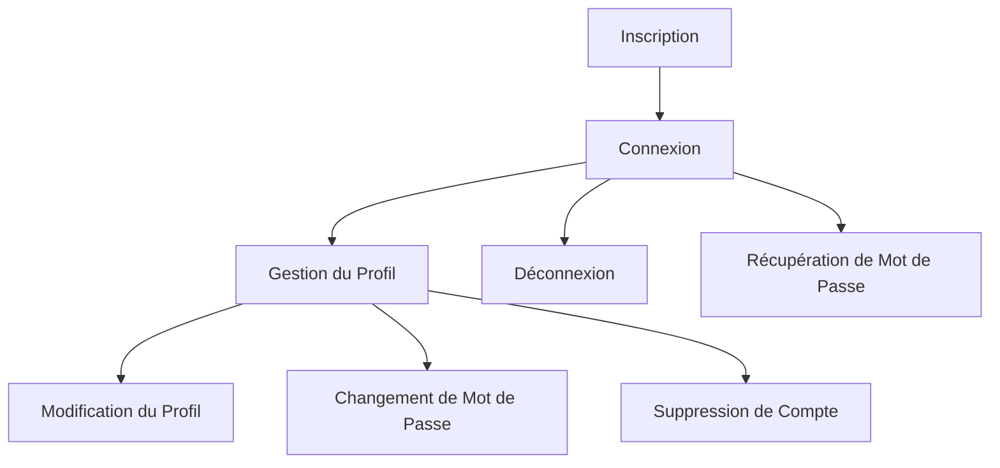

# Récits d'Authentification

Cette page présente les récits utilisateurs liés à l'authentification et à la gestion des comptes utilisateurs dans l'API EasyGroup.

## Vue d'Ensemble

Les fonctionnalités d'authentification permettent aux utilisateurs de créer et gérer leurs comptes, de se connecter à l'application et de gérer leur profil.

## Inscription

### US-AUTH-01: Inscription d'un Nouvel Utilisateur

**En tant que visiteur, je veux pouvoir créer un compte utilisateur afin d'accéder aux fonctionnalités de l'application.**

**Priorité** : Critique  
**Statut** : Terminé

**Critères d'Acceptation** :
1. Le formulaire d'inscription doit demander l'email, le mot de passe, le prénom et le nom
2. L'email doit être unique dans le système
3. Le mot de passe doit respecter les règles de sécurité (au moins 8 caractères, incluant au moins une majuscule, une minuscule, un chiffre et un caractère spécial)
4. L'utilisateur doit confirmer son mot de passe
5. L'utilisateur doit accepter les conditions d'utilisation
6. Après l'inscription réussie, l'utilisateur est automatiquement connecté
7. Un message de bienvenue est affiché après l'inscription réussie

**Notes Techniques** :
- Le mot de passe est haché avec Argon2id avant d'être stocké
- Un token JWT est généré et stocké dans un cookie HTTP-only
- Le rôle par défaut est "USER"

## Connexion

### US-AUTH-02: Connexion à un Compte Existant

**En tant qu'utilisateur inscrit, je veux pouvoir me connecter à mon compte afin d'accéder à mes données et aux fonctionnalités de l'application.**

**Priorité** : Critique  
**Statut** : Terminé

**Critères d'Acceptation** :
1. Le formulaire de connexion doit demander l'email et le mot de passe
2. En cas d'identifiants incorrects, un message d'erreur générique est affiché (sans préciser si c'est l'email ou le mot de passe qui est incorrect)
3. Après 5 tentatives échouées, le compte est temporairement verrouillé pendant 15 minutes
4. Après la connexion réussie, l'utilisateur est redirigé vers la page d'accueil
5. L'utilisateur peut choisir de rester connecté (option "Se souvenir de moi")

**Notes Techniques** :
- Le mot de passe est vérifié avec Argon2id
- Un token JWT est généré et stocké dans un cookie HTTP-only
- La durée de validité du token est de 24 heures par défaut, ou 30 jours si l'option "Se souvenir de moi" est activée

### US-AUTH-03: Déconnexion

**En tant qu'utilisateur connecté, je veux pouvoir me déconnecter afin de sécuriser mon compte lorsque je n'utilise pas l'application.**

**Priorité** : Élevée  
**Statut** : Terminé

**Critères d'Acceptation** :
1. Un bouton de déconnexion est accessible depuis toutes les pages
2. Après la déconnexion, l'utilisateur est redirigé vers la page de connexion
3. Un message de confirmation est affiché après la déconnexion réussie
4. Après la déconnexion, l'utilisateur ne peut plus accéder aux pages protégées

**Notes Techniques** :
- Le cookie contenant le token JWT est supprimé
- La session côté client est effacée

## Gestion du Profil

### US-AUTH-04: Consultation du Profil

**En tant qu'utilisateur connecté, je veux pouvoir consulter mon profil afin de vérifier mes informations personnelles.**

**Priorité** : Élevée  
**Statut** : Terminé

**Critères d'Acceptation** :
1. L'utilisateur peut accéder à son profil depuis le menu principal
2. La page de profil affiche l'email, le prénom, le nom et la date d'inscription
3. La page de profil affiche également le rôle de l'utilisateur

**Notes Techniques** :
- Les informations sont récupérées à partir du token JWT et de la base de données

### US-AUTH-05: Modification du Profil

**En tant qu'utilisateur connecté, je veux pouvoir modifier mon profil afin de maintenir mes informations à jour.**

**Priorité** : Élevée  
**Statut** : Terminé

**Critères d'Acceptation** :
1. L'utilisateur peut modifier son prénom et son nom
2. L'email ne peut pas être modifié (une nouvelle US sera créée pour cette fonctionnalité)
3. Les modifications sont validées avant d'être enregistrées
4. Un message de confirmation est affiché après la modification réussie

**Notes Techniques** :
- La date de dernière modification est mise à jour automatiquement
- Le token JWT est régénéré avec les nouvelles informations

### US-AUTH-06: Changement de Mot de Passe

**En tant qu'utilisateur connecté, je veux pouvoir changer mon mot de passe afin de maintenir la sécurité de mon compte.**

**Priorité** : Élevée  
**Statut** : Terminé

**Critères d'Acceptation** :
1. L'utilisateur doit fournir son mot de passe actuel
2. L'utilisateur doit saisir et confirmer son nouveau mot de passe
3. Le nouveau mot de passe doit respecter les règles de sécurité
4. Le nouveau mot de passe ne peut pas être identique à l'ancien
5. Un message de confirmation est affiché après le changement réussi

**Notes Techniques** :
- Le nouveau mot de passe est haché avec Argon2id avant d'être stocké
- Le token JWT est régénéré après le changement de mot de passe

### US-AUTH-07: Suppression de Compte

**En tant qu'utilisateur connecté, je veux pouvoir supprimer mon compte afin de retirer mes données de l'application.**

**Priorité** : Moyenne  
**Statut** : Terminé

**Critères d'Acceptation** :
1. L'utilisateur doit confirmer la suppression en saisissant son mot de passe
2. L'utilisateur est informé des conséquences de la suppression (perte de toutes les données)
3. Après la suppression, l'utilisateur est déconnecté et redirigé vers la page d'accueil
4. Un message de confirmation est affiché après la suppression réussie

**Notes Techniques** :
- Les données personnelles sont anonymisées plutôt que supprimées complètement
- Les listes créées par l'utilisateur sont supprimées
- Les partages de listes avec l'utilisateur sont révoqués

## Récupération de Mot de Passe

### US-AUTH-08: Demande de Réinitialisation de Mot de Passe

**En tant qu'utilisateur inscrit, je veux pouvoir demander la réinitialisation de mon mot de passe afin de récupérer l'accès à mon compte en cas d'oubli.**

**Priorité** : Élevée  
**Statut** : Terminé

**Critères d'Acceptation** :
1. L'utilisateur peut demander la réinitialisation depuis la page de connexion
2. L'utilisateur doit fournir son email
3. Un email contenant un lien de réinitialisation est envoyé à l'adresse fournie
4. Un message de confirmation est affiché, indiquant que si l'email existe, un lien de réinitialisation a été envoyé
5. Le lien de réinitialisation est valide pendant 1 heure

**Notes Techniques** :
- Un token de réinitialisation unique est généré et stocké en base de données
- L'email contient un lien avec ce token
- Aucune information sur l'existence de l'email n'est divulguée pour des raisons de sécurité

### US-AUTH-09: Réinitialisation de Mot de Passe

**En tant qu'utilisateur ayant demandé une réinitialisation, je veux pouvoir définir un nouveau mot de passe afin de récupérer l'accès à mon compte.**

**Priorité** : Élevée  
**Statut** : Terminé

**Critères d'Acceptation** :
1. L'utilisateur accède à un formulaire de réinitialisation via le lien reçu par email
2. L'utilisateur doit saisir et confirmer son nouveau mot de passe
3. Le nouveau mot de passe doit respecter les règles de sécurité
4. Après la réinitialisation réussie, l'utilisateur est redirigé vers la page de connexion
5. Un message de confirmation est affiché, indiquant que le mot de passe a été réinitialisé

**Notes Techniques** :
- Le token de réinitialisation est vérifié avant de permettre la réinitialisation
- Le token est invalidé après utilisation
- Le nouveau mot de passe est haché avec Argon2id avant d'être stocké

## Fonctionnalités Futures

### US-AUTH-10: Authentification à Deux Facteurs (2FA)

**En tant qu'utilisateur soucieux de la sécurité, je veux pouvoir activer l'authentification à deux facteurs afin de renforcer la sécurité de mon compte.**

**Priorité** : Faible  
**Statut** : À Faire

**Critères d'Acceptation** :
1. L'utilisateur peut activer/désactiver la 2FA depuis son profil
2. Lors de l'activation, l'utilisateur doit scanner un QR code avec une application d'authentification
3. L'utilisateur doit saisir un code de vérification pour confirmer l'activation
4. Après l'activation, l'utilisateur doit fournir un code de vérification à chaque connexion
5. L'utilisateur peut générer des codes de secours en cas de perte de son appareil

**Notes Techniques** :
- Utilisation de l'algorithme TOTP (Time-based One-Time Password)
- Les codes de secours sont hachés avant d'être stockés
- Un indicateur de 2FA active est ajouté au profil utilisateur

### US-AUTH-11: Connexion avec des Fournisseurs d'Identité Externes

**En tant que visiteur, je veux pouvoir me connecter avec mon compte Google ou Microsoft afin de simplifier le processus d'inscription et de connexion.**

**Priorité** : Faible  
**Statut** : À Faire

**Critères d'Acceptation** :
1. Des boutons de connexion avec Google et Microsoft sont disponibles sur les pages d'inscription et de connexion
2. L'utilisateur est redirigé vers le fournisseur d'identité pour s'authentifier
3. Après l'authentification réussie, l'utilisateur est redirigé vers l'application
4. Si c'est la première connexion, un compte est automatiquement créé avec les informations fournies par le fournisseur d'identité
5. Si le compte existe déjà, l'utilisateur est connecté à son compte existant

**Notes Techniques** :
- Utilisation du protocole OAuth 2.0 / OpenID Connect
- Les comptes créés via des fournisseurs externes n'ont pas de mot de passe local
- Un identifiant unique fourni par le fournisseur est stocké pour lier le compte