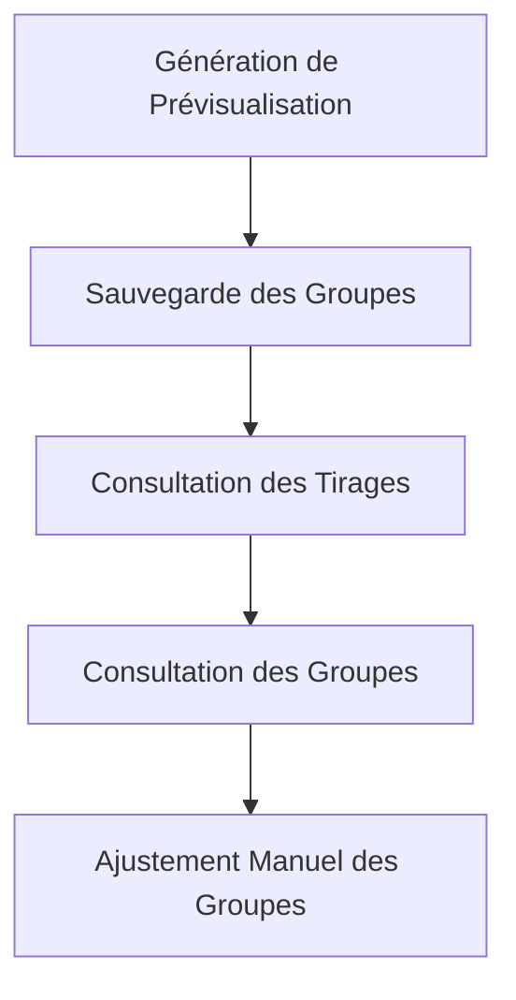

# Récits de Création de Groupes

Cette page présente les récits utilisateurs liés à la création et la gestion de groupes à partir des listes de personnes dans l'API EasyGroup.

## Vue d'Ensemble

Les fonctionnalités de création de groupes permettent aux utilisateurs de générer des groupes équilibrés à partir de leurs listes de personnes, en tenant compte de divers critères comme l'âge, le niveau de français, le niveau technique, etc.

## Génération et Sauvegarde des Groupes

### US-GROUP-01: Génération d'une Prévisualisation de Groupes

**En tant qu'utilisateur connecté, je veux pouvoir générer une prévisualisation de groupes à partir d'une liste afin de voir comment les personnes seraient réparties.**

**Priorité** : Critique  
**Statut** : Terminé

**Critères d'Acceptation** :
1. L'utilisateur peut sélectionner une liste dont il est propriétaire ou qui est partagée avec lui
2. L'utilisateur peut spécifier le nombre de groupes souhaité
3. L'utilisateur peut spécifier les critères d'équilibrage (âge, niveau de français, niveau technique, etc.)
4. Le système génère une prévisualisation des groupes équilibrés selon les critères spécifiés
5. L'utilisateur peut voir la composition de chaque groupe dans la prévisualisation

**Notes Techniques** :
- L'algorithme d'équilibrage prend en compte les critères spécifiés
- La prévisualisation n'est pas sauvegardée en base de données
- Les groupes sont générés de manière aléatoire tout en respectant les critères d'équilibrage

### US-GROUP-02: Sauvegarde des Groupes

**En tant qu'utilisateur connecté, je veux pouvoir sauvegarder les groupes générés afin de les conserver et de les consulter ultérieurement.**

**Priorité** : Critique  
**Statut** : Terminé

**Critères d'Acceptation** :
1. L'utilisateur peut sauvegarder les groupes générés dans la prévisualisation
2. L'utilisateur peut donner un titre au tirage
3. Les groupes sauvegardés sont associés à la liste et à l'utilisateur
4. Un message de confirmation est affiché après la sauvegarde réussie

**Notes Techniques** :
- Un tirage (Draw) est créé avec un identifiant UUID
- Chaque groupe est créé avec un identifiant UUID et associé au tirage
- Les personnes sont associées aux groupes via la table de jointure group_person

## Consultation et Gestion des Tirages et Groupes

### US-GROUP-03: Consultation des Tirages d'une Liste

**En tant qu'utilisateur connecté, je veux pouvoir consulter tous les tirages effectués sur une liste afin de voir l'historique des groupes générés.**

**Priorité** : Élevée  
**Statut** : Terminé

**Critères d'Acceptation** :
1. L'utilisateur peut voir la liste de tous les tirages effectués sur une liste spécifique
2. Pour chaque tirage, le titre et la date de création sont affichés
3. L'utilisateur peut cliquer sur un tirage pour voir les groupes générés
4. L'utilisateur ne peut consulter que les tirages des listes qu'il a créées ou qui sont partagées avec lui

**Notes Techniques** :
- Les tirages sont récupérés en fonction de l'ID de la liste
- Une vérification d'autorisation est effectuée pour s'assurer que l'utilisateur a accès à cette liste

### US-GROUP-04: Consultation des Groupes d'un Tirage

**En tant qu'utilisateur connecté, je veux pouvoir consulter les groupes générés lors d'un tirage afin de voir la répartition des personnes.**

**Priorité** : Élevée  
**Statut** : Terminé

**Critères d'Acceptation** :
1. L'utilisateur peut voir tous les groupes générés lors d'un tirage spécifique
2. Pour chaque groupe, le nom et la liste des personnes sont affichés
3. Pour chaque personne, le nom et les caractéristiques principales sont affichés
4. L'utilisateur ne peut consulter que les groupes des tirages des listes qu'il a créées ou qui sont partagées avec lui

**Notes Techniques** :
- Les groupes sont récupérés en fonction de l'ID du tirage
- Les personnes de chaque groupe sont récupérées via la table de jointure group_person

## Ajustement Manuel des Groupes

### US-GROUP-05: Ajout d'une Personne à un Groupe

**En tant qu'utilisateur connecté, je veux pouvoir ajouter manuellement une personne à un groupe afin d'ajuster la composition des groupes.**

**Priorité** : Moyenne  
**Statut** : Terminé

**Critères d'Acceptation** :
1. L'utilisateur peut ajouter une personne à un groupe existant
2. L'utilisateur ne peut ajouter que des personnes de la même liste que celle utilisée pour le tirage
3. L'utilisateur ne peut modifier que les groupes des tirages des listes qu'il a créées ou qui sont partagées avec lui
4. Un message de confirmation est affiché après l'ajout réussi

**Notes Techniques** :
- Une entrée est créée dans la table de jointure group_person
- Une vérification est effectuée pour s'assurer que la personne n'est pas déjà dans le groupe

### US-GROUP-06: Suppression d'une Personne d'un Groupe

**En tant qu'utilisateur connecté, je veux pouvoir supprimer une personne d'un groupe afin d'ajuster la composition des groupes.**

**Priorité** : Moyenne  
**Statut** : Terminé

**Critères d'Acceptation** :
1. L'utilisateur peut supprimer une personne d'un groupe existant
2. L'utilisateur ne peut modifier que les groupes des tirages des listes qu'il a créées ou qui sont partagées avec lui
3. Un message de confirmation est affiché après la suppression réussie

**Notes Techniques** :
- L'entrée correspondante est supprimée de la table de jointure group_person
- Une vérification est effectuée pour s'assurer que la personne est bien dans le groupe

## Fonctionnalités Futures

### US-GROUP-07: Création d'un Nouveau Groupe dans un Tirage

**En tant qu'utilisateur connecté, je veux pouvoir créer un nouveau groupe dans un tirage existant afin d'avoir plus de flexibilité dans la répartition des personnes.**

**Priorité** : Faible  
**Statut** : À Faire

**Critères d'Acceptation** :
1. L'utilisateur peut créer un nouveau groupe vide dans un tirage existant
2. L'utilisateur peut donner un nom au nouveau groupe
3. L'utilisateur peut ajouter des personnes au nouveau groupe
4. L'utilisateur ne peut modifier que les tirages des listes qu'il a créées ou qui sont partagées avec lui

**Notes Techniques** :
- Un nouveau groupe est créé avec un identifiant UUID et associé au tirage
- Le groupe est initialement vide (sans personnes)

### US-GROUP-08: Suppression d'un Groupe

**En tant qu'utilisateur connecté, je veux pouvoir supprimer un groupe d'un tirage afin de réorganiser les groupes.**

**Priorité** : Faible  
**Statut** : À Faire

**Critères d'Acceptation** :
1. L'utilisateur peut supprimer un groupe existant
2. L'utilisateur ne peut supprimer que les groupes des tirages des listes qu'il a créées ou qui sont partagées avec lui
3. Une confirmation est demandée avant la suppression
4. Après la suppression, le groupe n'apparaît plus dans la liste des groupes du tirage

**Notes Techniques** :
- Le groupe est supprimé en fonction de son ID
- Les entrées correspondantes dans la table de jointure group_person sont également supprimées

### US-GROUP-09: Export des Groupes

**En tant qu'utilisateur connecté, je veux pouvoir exporter les groupes générés vers un fichier CSV ou PDF afin de les partager facilement.**

**Priorité** : Faible  
**Statut** : À Faire

**Critères d'Acceptation** :
1. L'utilisateur peut exporter les groupes d'un tirage vers un fichier CSV ou PDF
2. L'utilisateur peut choisir le format d'export (CSV ou PDF)
3. Le fichier exporté contient le nom du tirage, la date de création, et la composition de chaque groupe
4. Le fichier est généré et téléchargé automatiquement

**Notes Techniques** :
- Pour le format CSV, les données sont formatées avec des séparateurs appropriés
- Pour le format PDF, un template est utilisé pour générer un document bien formaté
- L'encodage UTF-8 est utilisé pour supporter les caractères spéciaux