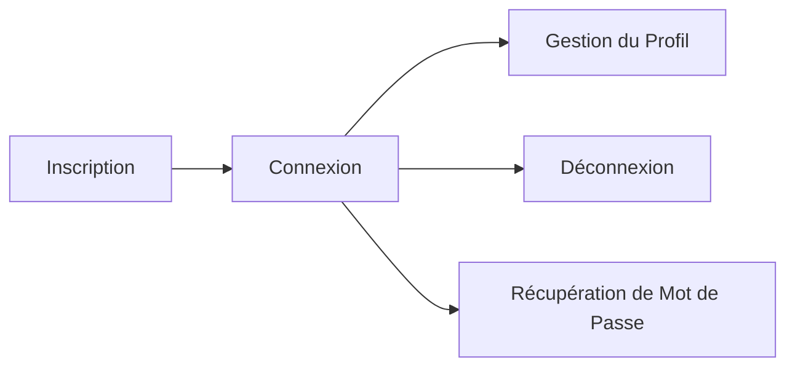
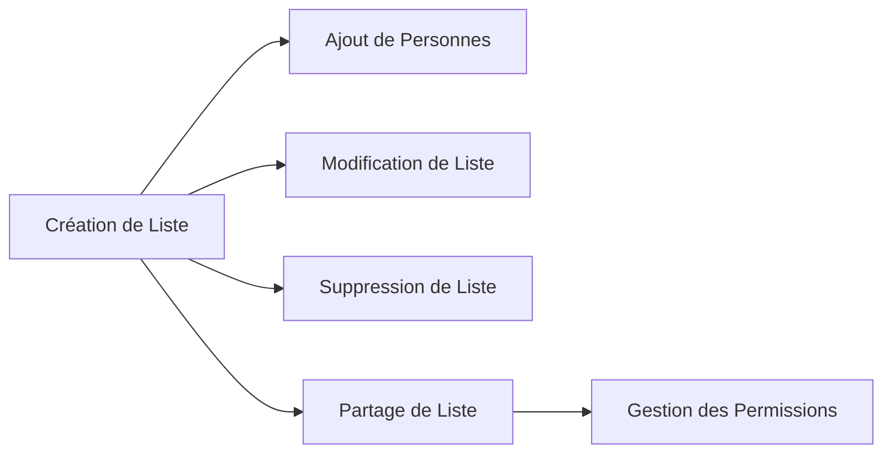
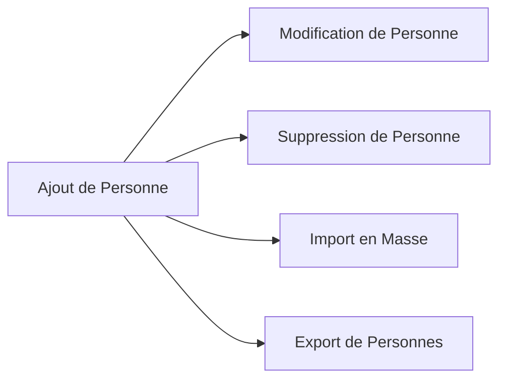
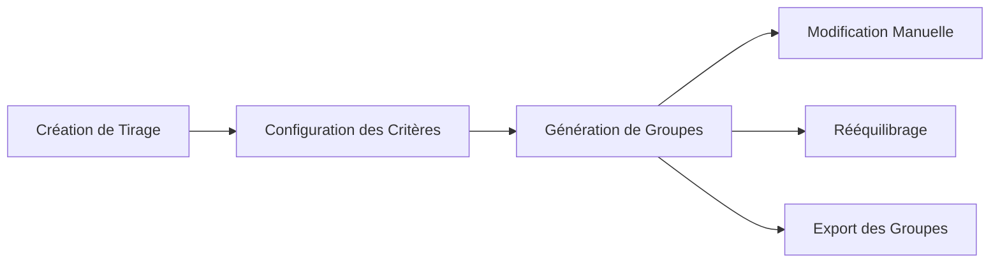
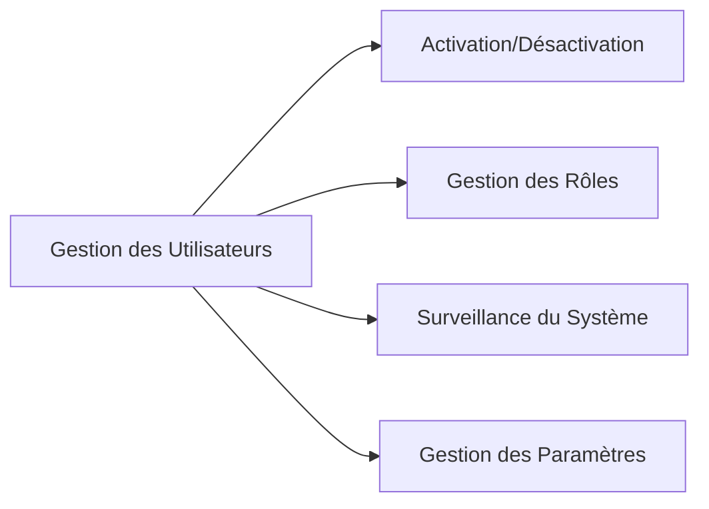

# Récits Utilisateurs

Cette section présente les récits utilisateurs (user stories) qui décrivent les fonctionnalités de l'API EasyGroup du point de vue des utilisateurs. Ces récits sont organisés par domaine fonctionnel et incluent les critères d'acceptation pour chaque fonctionnalité.

## Qu'est-ce qu'un Récit Utilisateur ?

Un récit utilisateur est une description simple d'une fonctionnalité du point de vue de la personne qui désire cette fonctionnalité. Les récits utilisateurs suivent généralement le format :

> En tant que [type d'utilisateur], je veux [objectif] afin de [raison/bénéfice].

Chaque récit est accompagné de critères d'acceptation qui définissent les conditions qui doivent être remplies pour que la fonctionnalité soit considérée comme complète.

## Domaines Fonctionnels

Les récits utilisateurs de l'API EasyGroup sont organisés selon les domaines fonctionnels suivants :

### [Authentification](./authentication)

Récits liés à l'inscription, la connexion et la gestion des comptes utilisateurs.

### [Gestion des Listes](./list-management)

Récits liés à la création, modification, suppression et partage de listes de personnes.

### [Gestion des Personnes](./person-management)

Récits liés à l'ajout, la modification et la suppression de personnes dans les listes.

### [Création de Groupes](./group-creation)

Récits liés à la création et la gestion de groupes à partir des listes de personnes.

### [Administration](./administration)

Récits liés à l'administration de la plateforme (réservés aux administrateurs).

## Priorités des Récits

Les récits utilisateurs sont classés selon les priorités suivantes :

- **Critique** : Fonctionnalités essentielles sans lesquelles l'application ne peut pas fonctionner
- **Élevée** : Fonctionnalités importantes qui apportent une valeur significative aux utilisateurs
- **Moyenne** : Fonctionnalités utiles mais non essentielles
- **Faible** : Fonctionnalités qui améliorent l'expérience utilisateur mais peuvent être reportées

## Statut des Récits

Chaque récit utilisateur a un statut qui indique son état d'avancement :

- **À Faire** : Le récit n'a pas encore été implémenté
- **En Cours** : Le récit est en cours d'implémentation
- **Terminé** : Le récit a été implémenté et répond à tous les critères d'acceptation
- **Reporté** : L'implémentation du récit a été reportée à une version ultérieure

## Exemple de Récit Utilisateur

Voici un exemple de récit utilisateur complet avec ses critères d'acceptation :

### Création d'une Liste de Personnes

**En tant qu'utilisateur connecté, je veux créer une nouvelle liste de personnes afin de pouvoir organiser mes contacts.**

**Priorité** : Élevée  
**Statut** : Terminé

**Critères d'Acceptation** :
1. L'utilisateur peut créer une nouvelle liste en spécifiant un nom
2. Le nom de la liste est obligatoire et doit contenir entre 3 et 50 caractères
3. L'utilisateur devient automatiquement le propriétaire de la liste
4. La liste nouvellement créée apparaît dans la liste des listes de l'utilisateur
5. L'utilisateur est redirigé vers la page de détail de la liste après sa création
6. Un message de confirmation est affiché après la création réussie de la liste

**Notes Techniques** :
- La liste est associée à l'ID de l'utilisateur connecté
- Un timestamp de création est automatiquement ajouté
- La liste est initialement vide (sans personnes)

## Navigation dans les Récits Utilisateurs

Utilisez les liens ci-dessous pour explorer les récits utilisateurs par domaine fonctionnel :

- [Authentification](./authentication)
- [Gestion des Listes](./list-management)
- [Gestion des Personnes](./person-management)
- [Création de Groupes](./group-creation)
- [Administration](./administration)