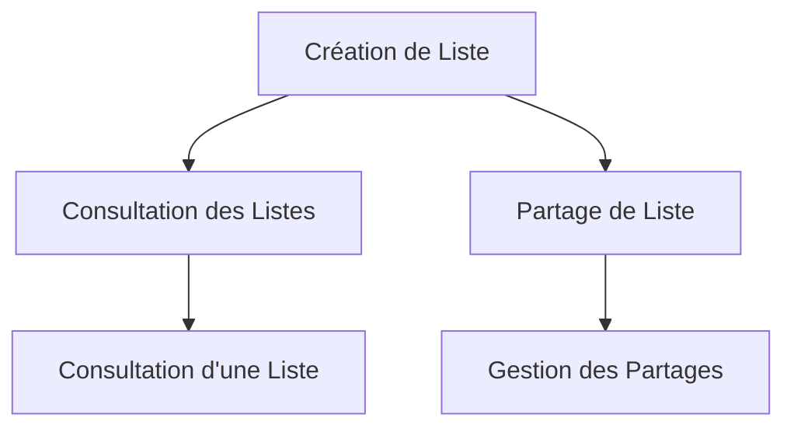

# Récits de Gestion des Listes

Cette page présente les récits utilisateurs liés à la création, modification, suppression et partage de listes de personnes dans l'API EasyGroup.

## Vue d'Ensemble

Les fonctionnalités de gestion des listes permettent aux utilisateurs de créer et gérer des listes de personnes, qui serviront ensuite à la création de groupes.

## Création et Gestion des Listes

### US-LIST-01: Création d'une Liste

**En tant qu'utilisateur connecté, je veux pouvoir créer une nouvelle liste afin d'y ajouter des personnes.**

**Priorité** : Critique  
**Statut** : Terminé

**Critères d'Acceptation** :
1. L'utilisateur peut créer une nouvelle liste en spécifiant un nom
2. Le nom de la liste est obligatoire
3. Le nom de la liste doit être unique pour cet utilisateur
4. L'utilisateur devient automatiquement le propriétaire de la liste
5. La liste nouvellement créée apparaît dans la liste des listes de l'utilisateur

**Notes Techniques** :
- La liste est associée à l'ID de l'utilisateur connecté
- Un identifiant UUID est généré pour la liste
- La liste est initialement vide (sans personnes)

### US-LIST-02: Consultation des Listes

**En tant qu'utilisateur connecté, je veux pouvoir consulter toutes mes listes afin de gérer mon contenu.**

**Priorité** : Critique  
**Statut** : Terminé

**Critères d'Acceptation** :
1. L'utilisateur peut voir la liste de toutes ses listes (créées ou partagées avec lui)
2. Pour chaque liste, le nom et le statut de partage sont affichés
3. L'utilisateur peut cliquer sur une liste pour voir son contenu détaillé

**Notes Techniques** :
- Les listes sont récupérées en fonction de l'ID de l'utilisateur connecté
- Les listes partagées avec l'utilisateur sont également incluses

### US-LIST-03: Consultation d'une Liste Spécifique

**En tant qu'utilisateur connecté, je veux pouvoir consulter le détail d'une liste spécifique afin de voir son contenu.**

**Priorité** : Critique  
**Statut** : Terminé

**Critères d'Acceptation** :
1. L'utilisateur peut voir le nom de la liste
2. L'utilisateur peut voir le statut de partage de la liste
3. L'utilisateur peut voir la liste des personnes dans cette liste
4. L'utilisateur ne peut consulter que les listes qu'il a créées ou qui sont partagées avec lui

**Notes Techniques** :
- La liste est récupérée en fonction de son ID et de l'ID de l'utilisateur connecté
- Une vérification d'autorisation est effectuée pour s'assurer que l'utilisateur a accès à cette liste

## Partage de Listes

### US-LIST-04: Partage d'une Liste

**En tant que propriétaire d'une liste, je veux pouvoir partager ma liste avec d'autres utilisateurs afin de collaborer.**

**Priorité** : Élevée  
**Statut** : Terminé

**Critères d'Acceptation** :
1. L'utilisateur peut partager une liste avec un autre utilisateur en spécifiant son email
2. L'utilisateur ne peut partager que les listes dont il est propriétaire
3. Un email de notification est envoyé à l'utilisateur avec qui la liste est partagée
4. La liste partagée apparaît dans la liste des listes de l'utilisateur avec qui elle est partagée

**Notes Techniques** :
- Une entrée est créée dans la table ListShare
- Le statut de partage de la liste est mis à jour (isShared = true)

### US-LIST-05: Révocation d'un Partage

**En tant que propriétaire d'une liste, je veux pouvoir révoquer le partage d'une liste afin de contrôler l'accès à mes données.**

**Priorité** : Élevée  
**Statut** : Terminé

**Critères d'Acceptation** :
1. L'utilisateur peut révoquer le partage d'une liste avec un utilisateur spécifique
2. L'utilisateur ne peut révoquer que les partages des listes dont il est propriétaire
3. Après la révocation, l'utilisateur avec qui la liste était partagée ne peut plus y accéder
4. La liste disparaît de la liste des listes de l'utilisateur avec qui elle était partagée

**Notes Techniques** :
- L'entrée correspondante est supprimée de la table ListShare
- Si c'était le dernier partage, le statut de partage de la liste est mis à jour (isShared = false)

## Fonctionnalités Futures

### US-LIST-06: Modification d'une Liste

**En tant que propriétaire d'une liste, je veux pouvoir modifier le nom de ma liste afin de la renommer si nécessaire.**

**Priorité** : Moyenne  
**Statut** : À Faire

**Critères d'Acceptation** :
1. L'utilisateur peut modifier le nom d'une liste existante
2. L'utilisateur ne peut modifier que les listes dont il est propriétaire
3. Le nouveau nom doit être unique pour cet utilisateur
4. Un message de confirmation est affiché après la modification réussie

**Notes Techniques** :
- La liste est mise à jour en fonction de son ID et de l'ID de l'utilisateur connecté

### US-LIST-07: Suppression d'une Liste

**En tant que propriétaire d'une liste, je veux pouvoir supprimer une liste afin de nettoyer mon espace de travail.**

**Priorité** : Moyenne  
**Statut** : À Faire

**Critères d'Acceptation** :
1. L'utilisateur peut supprimer une liste existante
2. L'utilisateur ne peut supprimer que les listes dont il est propriétaire
3. Une confirmation est demandée avant la suppression
4. Après la suppression, la liste n'apparaît plus dans la liste des listes de l'utilisateur
5. Toutes les personnes associées à cette liste sont également supprimées

**Notes Techniques** :
- La suppression est en cascade (suppression des personnes, des partages, etc.)
- Les tirages associés à cette liste sont également supprimés

### US-LIST-08: Archivage d'une Liste

**En tant que propriétaire d'une liste, je veux pouvoir archiver une liste afin de la conserver sans l'afficher dans ma liste principale.**

**Priorité** : Faible  
**Statut** : À Faire

**Critères d'Acceptation** :
1. L'utilisateur peut archiver une liste existante
2. L'utilisateur ne peut archiver que les listes dont il est propriétaire
3. Les listes archivées sont accessibles dans une section "Archives"
4. L'utilisateur peut désarchiver une liste archivée

**Notes Techniques** :
- Un champ "archived" (boolean) sera ajouté à la table List
- Les listes archivées ne sont pas incluses dans la liste principale par défaut