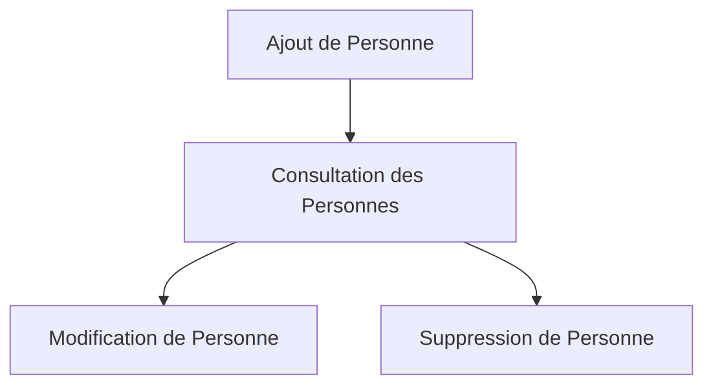

# Récits de Gestion des Personnes

Cette page présente les récits utilisateurs liés à l'ajout, la modification et la suppression de personnes dans les listes de l'API EasyGroup.

## Vue d'Ensemble

Les fonctionnalités de gestion des personnes permettent aux utilisateurs d'ajouter, modifier et supprimer des personnes dans leurs listes, avec différentes caractéristiques qui seront utilisées pour la création de groupes équilibrés.

## Ajout et Consultation des Personnes

### US-PERSON-01: Ajout d'une Personne à une Liste

**En tant qu'utilisateur connecté, je veux pouvoir ajouter une personne à ma liste afin de l'inclure dans mes futurs groupes.**

**Priorité** : Critique  
**Statut** : Terminé

**Critères d'Acceptation** :
1. L'utilisateur peut ajouter une personne à une liste dont il est propriétaire ou qui est partagée avec lui
2. L'utilisateur doit spécifier le nom de la personne
3. L'utilisateur doit spécifier le genre de la personne (FEMALE, MALE, OTHER)
4. L'utilisateur doit spécifier l'âge de la personne
5. L'utilisateur doit spécifier le niveau de français de la personne (1-5)
6. L'utilisateur doit indiquer si la personne est issue d'une ancienne formation DWWM (oui/non)
7. L'utilisateur doit spécifier le niveau technique de la personne (1-5)
8. L'utilisateur doit spécifier le profil de la personne (A_LAISE, RESERVE, TIMIDE)
9. La personne est ajoutée à la liste et apparaît dans la liste des personnes

**Notes Techniques** :
- Un identifiant UUID est généré pour la personne
- La personne est associée à la liste spécifiée
- Tous les champs sont obligatoires

### US-PERSON-02: Consultation des Personnes d'une Liste

**En tant qu'utilisateur connecté, je veux pouvoir consulter toutes les personnes d'une liste afin de voir qui est inclus.**

**Priorité** : Critique  
**Statut** : Terminé

**Critères d'Acceptation** :
1. L'utilisateur peut voir la liste de toutes les personnes d'une liste spécifique
2. Pour chaque personne, le nom, le genre, l'âge, le niveau de français, le statut DWWM, le niveau technique et le profil sont affichés
3. L'utilisateur ne peut consulter que les personnes des listes qu'il a créées ou qui sont partagées avec lui

**Notes Techniques** :
- Les personnes sont récupérées en fonction de l'ID de la liste
- Une vérification d'autorisation est effectuée pour s'assurer que l'utilisateur a accès à cette liste

## Modification et Suppression des Personnes

### US-PERSON-03: Modification d'une Personne

**En tant qu'utilisateur connecté, je veux pouvoir modifier les informations d'une personne afin de les mettre à jour.**

**Priorité** : Élevée  
**Statut** : Terminé

**Critères d'Acceptation** :
1. L'utilisateur peut modifier les informations d'une personne existante
2. L'utilisateur ne peut modifier que les personnes des listes qu'il a créées ou qui sont partagées avec lui
3. L'utilisateur peut modifier le nom, le genre, l'âge, le niveau de français, le statut DWWM, le niveau technique et le profil
4. Un message de confirmation est affiché après la modification réussie

**Notes Techniques** :
- La personne est mise à jour en fonction de son ID
- Une vérification d'autorisation est effectuée pour s'assurer que l'utilisateur a accès à cette personne

### US-PERSON-04: Suppression d'une Personne

**En tant qu'utilisateur connecté, je veux pouvoir supprimer une personne d'une liste afin de la retirer.**

**Priorité** : Élevée  
**Statut** : Terminé

**Critères d'Acceptation** :
1. L'utilisateur peut supprimer une personne existante
2. L'utilisateur ne peut supprimer que les personnes des listes qu'il a créées ou qui sont partagées avec lui
3. Une confirmation est demandée avant la suppression
4. Après la suppression, la personne n'apparaît plus dans la liste des personnes

**Notes Techniques** :
- La personne est supprimée en fonction de son ID
- Une vérification d'autorisation est effectuée pour s'assurer que l'utilisateur a accès à cette personne
- Si la personne est incluse dans des groupes, elle est également retirée de ces groupes

## Fonctionnalités Futures

### US-PERSON-05: Import de Personnes depuis un Fichier CSV

**En tant qu'utilisateur connecté, je veux pouvoir importer des personnes depuis un fichier CSV afin d'ajouter rapidement plusieurs personnes à ma liste.**

**Priorité** : Moyenne  
**Statut** : À Faire

**Critères d'Acceptation** :
1. L'utilisateur peut télécharger un modèle de fichier CSV
2. L'utilisateur peut importer un fichier CSV contenant des personnes
3. Le système valide le format du fichier et les données
4. Les personnes valides sont ajoutées à la liste
5. Un rapport d'importation est affiché, indiquant le nombre de personnes importées et les éventuelles erreurs

**Notes Techniques** :
- Le fichier CSV doit avoir un format spécifique (en-têtes, types de données)
- Une validation est effectuée pour chaque ligne du fichier
- L'importation est transactionnelle (tout ou rien)

### US-PERSON-06: Export de Personnes vers un Fichier CSV

**En tant qu'utilisateur connecté, je veux pouvoir exporter les personnes d'une liste vers un fichier CSV afin de les utiliser dans d'autres applications.**

**Priorité** : Faible  
**Statut** : À Faire

**Critères d'Acceptation** :
1. L'utilisateur peut exporter les personnes d'une liste vers un fichier CSV
2. L'utilisateur peut choisir les champs à inclure dans l'export
3. Le fichier CSV est généré et téléchargé automatiquement

**Notes Techniques** :
- Le fichier CSV inclut des en-têtes pour chaque colonne
- Les données sont formatées de manière appropriée pour chaque type de champ
- L'encodage UTF-8 est utilisé pour supporter les caractères spéciaux

### US-PERSON-07: Filtrage et Recherche de Personnes

**En tant qu'utilisateur connecté, je veux pouvoir filtrer et rechercher des personnes dans ma liste afin de trouver rapidement des personnes spécifiques.**

**Priorité** : Faible  
**Statut** : À Faire

**Critères d'Acceptation** :
1. L'utilisateur peut rechercher des personnes par nom
2. L'utilisateur peut filtrer les personnes par genre, âge, niveau de français, statut DWWM, niveau technique et profil
3. Les résultats de recherche et de filtrage sont mis à jour en temps réel
4. L'utilisateur peut réinitialiser les filtres pour voir toutes les personnes

**Notes Techniques** :
- La recherche est insensible à la casse et aux accents
- Les filtres peuvent être combinés pour affiner les résultats
- La pagination est maintenue lors de l'application des filtres